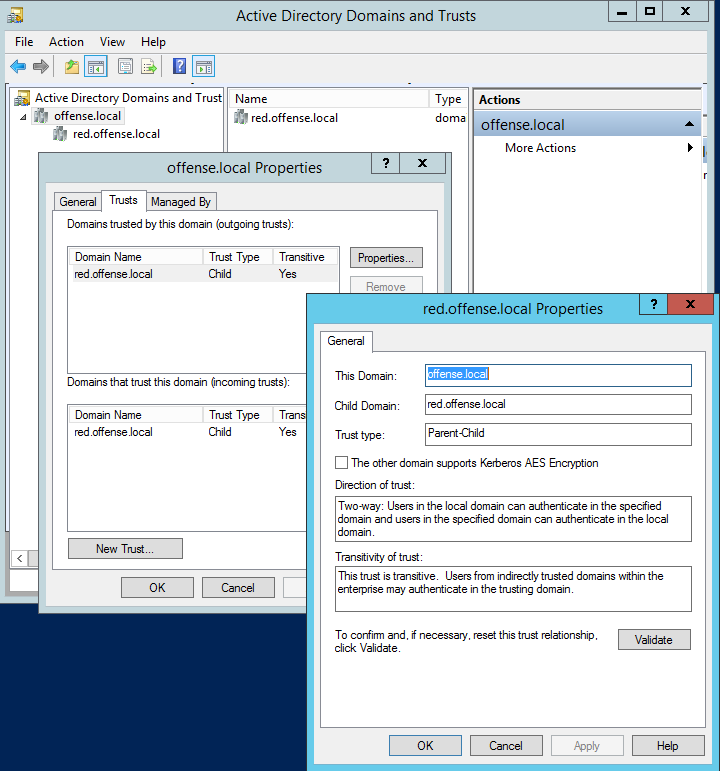
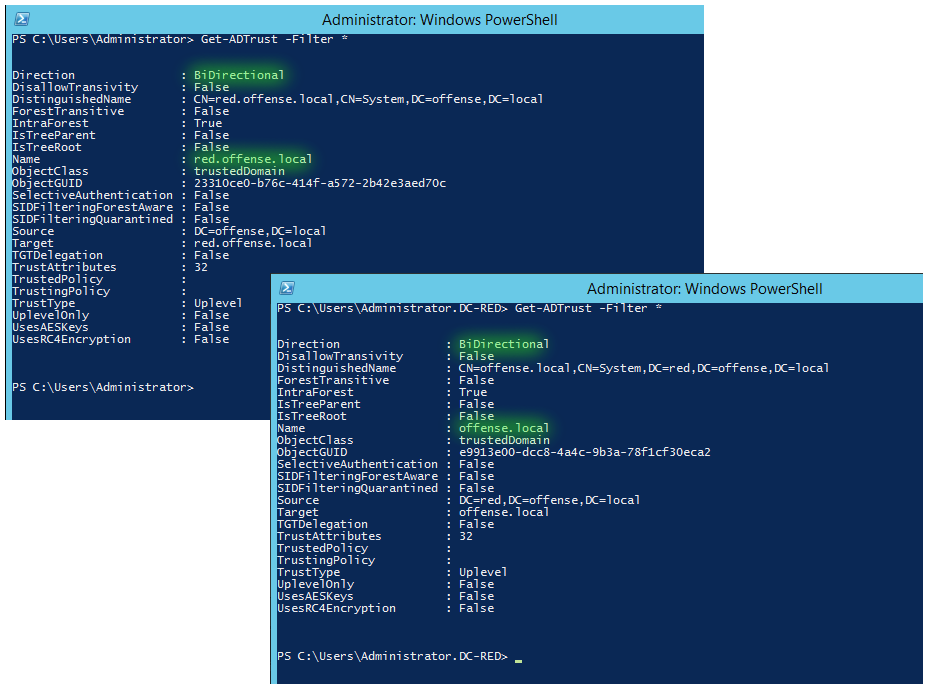
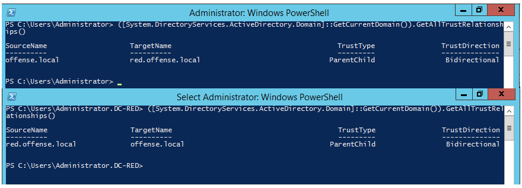
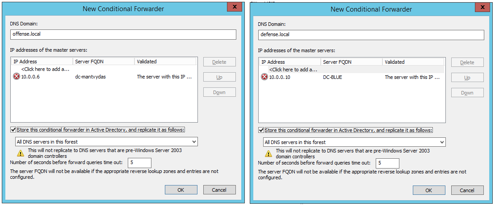
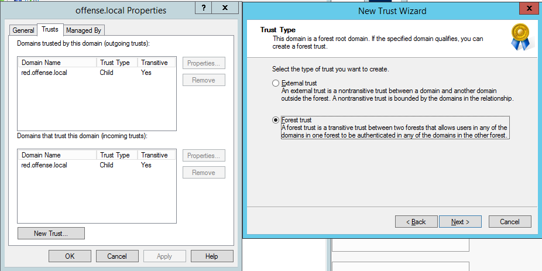

# Child Domain DA to EA in Parent Domain

This lab is based on an [Empire Case Study](https://enigma0x3.net/2016/01/28/an-empire-case-study/) and its goal is to get more familiar with some of the concepts of Powershell Empire and its modules as well as Active Directory concepts such as Forests, Parent/Child domains and Trust Relationships and how they can be abused to escalate privileges.

## Domain Trust Relationships

Firstly, some LAB setup - need to create a child domain controller as well as a new forest with a new domain controller.

### Parent / Child domains

After installing a child domain `red.offense.local` of a parent domain `offense.local`, Active Directory Domains and Trusts show the parent-child relationship between the domains as well as their default trusts:



Trusts between the two domains could be checked from powershell by issuing:

```csharp
Get-ADTrust -Filter *
```

The first console shows the domain trust relationship from `offense.local` perspective and the second one from `red.offense.local`. Note the the direction is `BiDirectional` which means that members can authenticate from one domain to another when they want to access shared resources:



Similar, but very simplified information could be gleaned from a native Windows binary:

```text
nltest /domain_trusts
```


Powershell way of checking trust relationships:

```csharp
([System.DirectoryServices.ActiveDirectory.Domain]::GetCurrentDomain()).GetAllTrustRelationships()
```



### Forests

After installing a new DC `dc-blue` in a new forest, let's setup a one way trust between `offense.local` and `defense.local` domains using contollers `dc-mantvydas.offense.local` and `dc-blue.defense.blue`.

First of, setting up condictional DNS forwarders on both DCs:



Adding a new trust by making `dc-mantvydas` a trusted domain:


Setting the trus type to `Forest`:



Incoming trust for dc-mantvydas.offense.local is now created:


Testing nltest output:


### Forests test

Now that the trust relationship is set, it is easy to check if it was done correctly. What should happen now is that resources on dc-blue.defense.local \(trusting domain\) should be available to members of offense.local \(trusted domain\).

Note how the user on `dc-mantvydas.offense.local` is not able to share a folder to `defense\administrator` \(because `offense.local` does not trust `defense.local`\):


However, `dc-blue.defense.local`, trusts `offense.local`, hence is able to share a resource to one of the members of `offense.local` - forests setup correctly and as intended:


## Back to Empire: From DA to EA

We just got an agent back from 

```csharp
shell [Direshell [DirectoryServices.ActiveDirectory.Domain]::GetCurrentDomain().DomainControllers | ForEach-Object { $_.Name }
shell dir \\dc-red.red.offense.local\c$
usemodule lateral_movement/invoke_wmi
```

{% embed data="{\"url\":\"https://enigma0x3.net/2016/01/28/an-empire-case-study/\",\"type\":\"link\",\"title\":\"An Empire Case Study\",\"description\":\"This post is part of the ‘Empire Series’, with some background and an ongoing list of series posts \[kept here\].  Empire has gotten a lot of use since its initial release at BSides Las Vegas. Most o…\",\"icon\":{\"type\":\"icon\",\"url\":\"https://s1.wp.com/i/favicon.ico\",\"aspectRatio\":0},\"thumbnail\":{\"type\":\"thumbnail\",\"url\":\"https://enigma0x3.files.wordpress.com/2016/01/lab\_local\_krbtgt.png\",\"width\":1244,\"height\":1160,\"aspectRatio\":0.932475884244373}}" %}

{% embed data="{\"url\":\"http://www.harmj0y.net/blog/redteaming/trusts-you-might-have-missed/\",\"type\":\"link\",\"title\":\"Trusts You Might Have Missed\",\"description\":\"\[Edit 8/13/15\] – Here is how the old version 1.9 cmdlets in this post translate to PowerView 2.0: Get-NetForestTrusts  ->  Get-NetForestTrusts Get-NetForestDomains  ->  Get-NetForestDom…\",\"icon\":{\"type\":\"icon\",\"url\":\"http://www.harmj0y.net/blog/wp-content/uploads/2017/05/cropped-specter-192x192.png\",\"width\":192,\"height\":192,\"aspectRatio\":1},\"thumbnail\":{\"type\":\"thumbnail\",\"url\":\"http://www.harmj0y.net/blog/wp-content/uploads/2014/06/powerview\_forest\_domain.png\",\"width\":735,\"height\":691,\"aspectRatio\":0.9401360544217687}}" %}

{% embed data="{\"url\":\"https://docs.microsoft.com/en-us/previous-versions/windows/it-pro/windows-server-2008-R2-and-2008/cc731404\(v%3dws.10\)\",\"type\":\"link\",\"title\":\"Understanding Trust Direction\",\"icon\":{\"type\":\"icon\",\"url\":\"https://docs.microsoft.com/favicon.ico\",\"aspectRatio\":0},\"thumbnail\":{\"type\":\"thumbnail\",\"url\":\"https://docs.microsoft.com/\_themes/docs.theme/master/en-us/\_themes/images/microsoft-header.png\",\"width\":128,\"height\":128,\"aspectRatio\":1}}" %}

{% embed data="{\"url\":\"https://docs.microsoft.com/en-us/powershell/module/activedirectory/get-adtrust?view=winserver2012-ps\",\"type\":\"link\",\"title\":\"Get-ADTrust \(activedirectory\)\",\"description\":\"The Get-ADTrust cmdlet returns all trusted domain objects in the directory.\",\"icon\":{\"type\":\"icon\",\"url\":\"https://docs.microsoft.com/favicon.ico\",\"aspectRatio\":0},\"thumbnail\":{\"type\":\"thumbnail\",\"url\":\"https://docs.microsoft.com/\_themes/docs.theme/master/en-us/\_themes/images/microsoft-header.png\",\"width\":128,\"height\":128,\"aspectRatio\":1}}" %}



