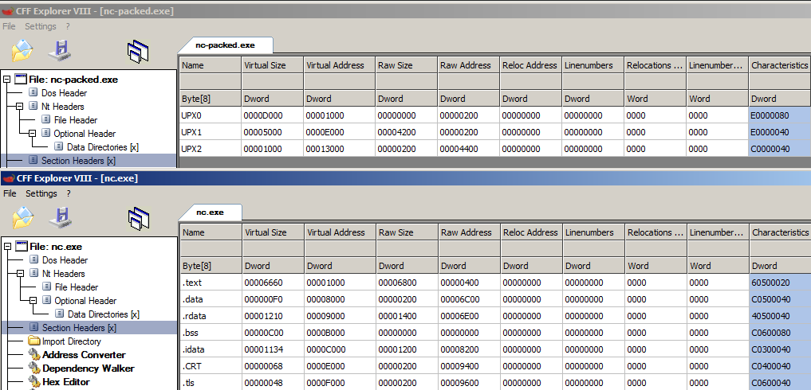
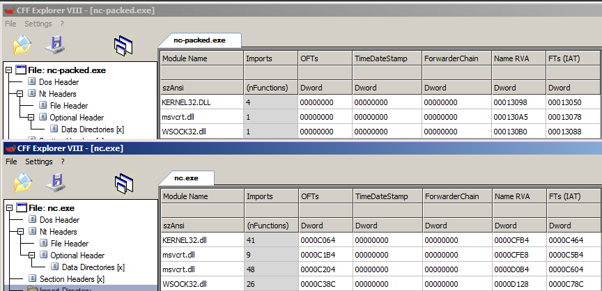
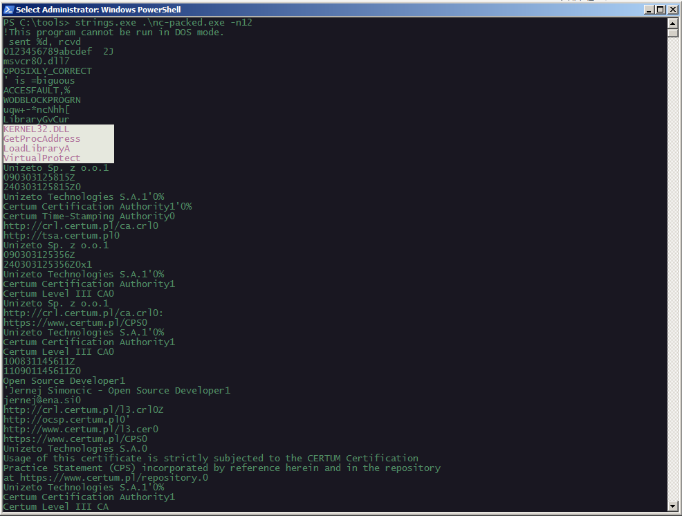

# T1045: Software Packing - UPX

For this exercise, I will pack a binary with a legendary UPX packer.

## Execution

```csharp
.\upx.exe -9 -o .\nc-packed.exe .\nc.exe
```


Note how the file shrank by 50%!

## Observations

Some of the tell-tale signs of a UPX packed binary are the PE section headers - note the differences between `nc-packed.exe` and `nc.exe`:



Another sign of a potentially packed binary is a low\(-er\) number of imports:



Note how packed binary only imports one function from the `WSOCK32.dll` and many more in a non-packed:


A classic sign of a packed binary is the imported functions from a `KERNEL32.dll`. The functions `LoadLibraryA` and `GetProcAddress` are crucial for the binary as they are used to locate other important functions of the `KERNEL32.dll` loaded to the process memory, hence packed binaries will almost always have those functions exposed:


If there are no fancy tools to hand, but you have strings.exe, you can make a fairly good guess whether the binary is packed by just running strings against it and noting the DLL imports - if there's only a few of them and they are from KERNEL32.dll - the binary is likely packed:



