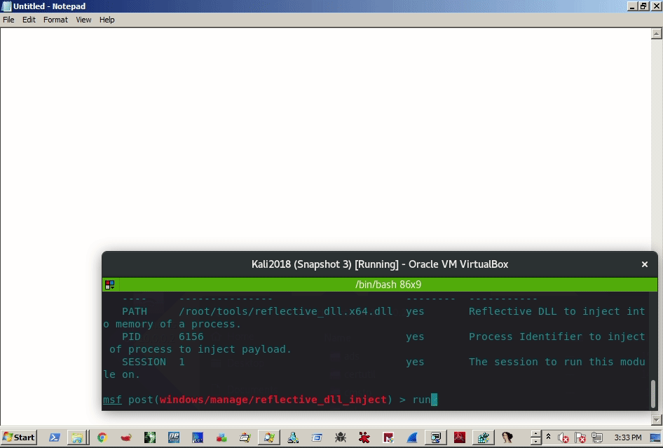

# Reflective DLL Injection

This is a DLL injection technique where a malicious binary writes some evil DLL's contents into a remote \(victim\) process and makes the victim process load that DLL and execute malicious code contained by that evil DLL.

This is done in a series of steps, but one of key pieces is that Process Environment Block is leveraged of the victim's process in order to find the required loaded modules such as `kernel32` and then find its exported functions such as `LoadLibrary`, `GetProcAddress` and `VirtualAlloc`.

For our exploration of the PEB:



## Execution

## Observations

