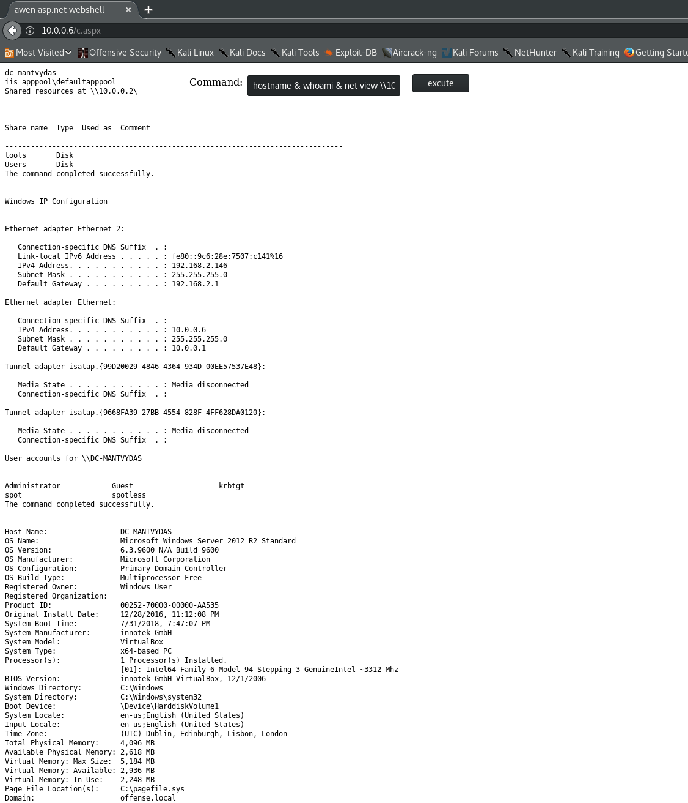
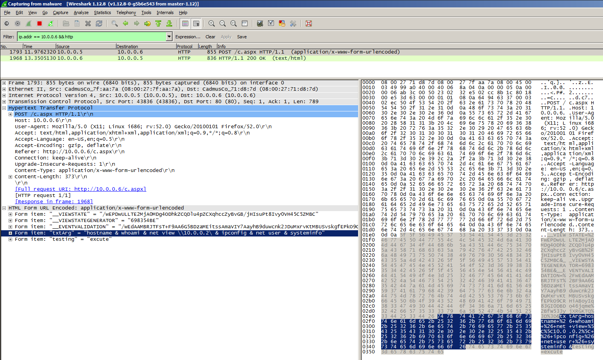
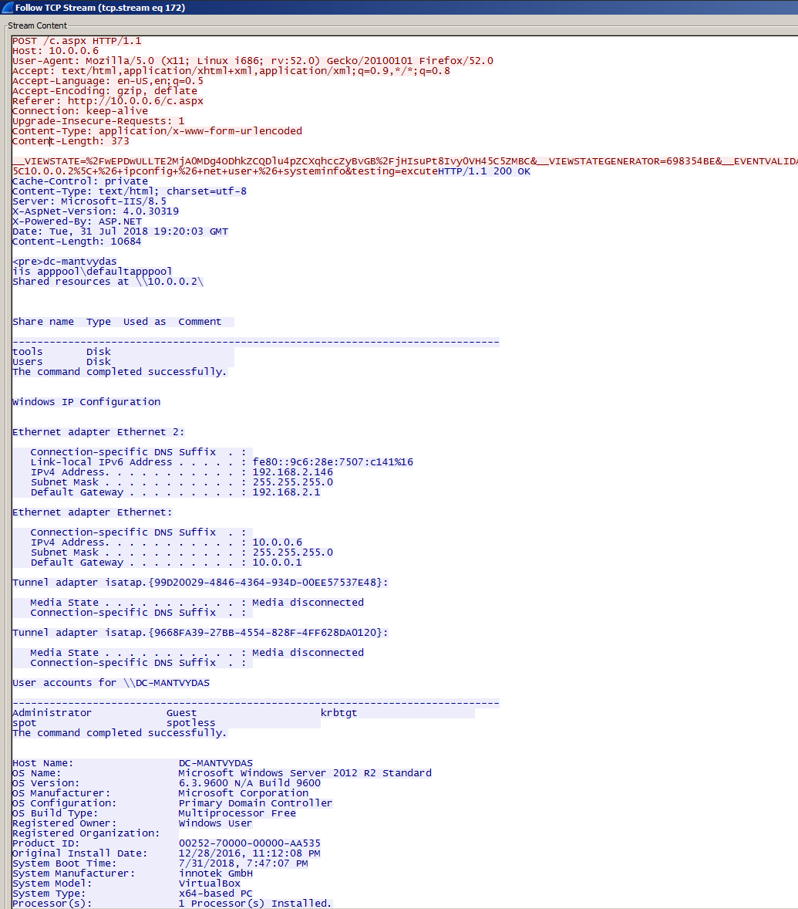
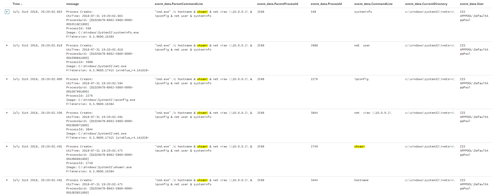

# T1108: WebShells

## Execution

This demo assumes a server compromise and that the attacker has already uploaded a webshell to the compromised host for persistence.

Below shows a simple webshell uploaded to a compromised Windows 2008R at 10.0.0.6 server running an IIS web service. It also shows output of the classic system enumeration commands - net, whoami, ipconfig, etc:

## Observations

Note that this particular webshell's HTTP requests are sent to the webserver via POST method, which means looking at the IIS web logs will not allow you to see what commands were issued - you will just see a bunch of requests to the `c.aspx` file:

However, if you have a the ability to sniff the network, you can see the attacker's commands and their responses:

Looking at sysmon process creation logs, we can immediately identify nefarious behaviour - we can see multiple enumeration commands being invoked from `c:\windows\system\inetsrv` working directory under a `ISS\APPOOL\DefaultAppPool` user - this should not happen under normal circumstances and should raise your suspicion:



