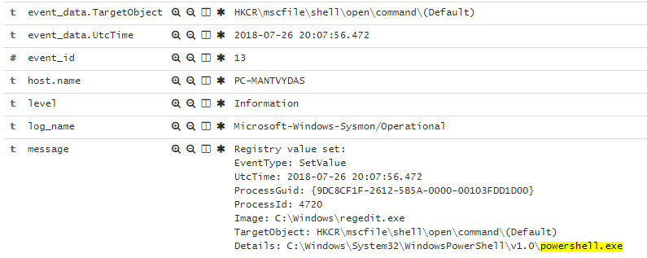

# T1122: COM Hijacking

## Execution

On the compromised system, change the `HKEY_LOCAL_MACHINE\SOFTWARE\Classes\mscfile\shell\open\command` default value to point to your binary. In this case I chose powershell.exe:

By default, launching Windows Event Viewer calls under the hood:`"C:\Windows\system32\mmc.exe" "C:\Windows\system32\eventvwr.msc" /s` 

Since we hijacked the `HKEY_LOCAL_MACHINE\SOFTWARE\Classes\mscfile\shell\open\command` to point to powershell, when launching Even Viewer, powershell is launched instead:

## Observation

Monitoring registry for changes in `HKEY_CLASSES_ROOT\mscfile\shell\open\command` can reveal this hijaking activity:



{% embed data="{\"url\":\"https://enigma0x3.net/2016/08/15/fileless-uac-bypass-using-eventvwr-exe-and-registry-hijacking/\",\"type\":\"link\",\"title\":\"“Fileless” UAC Bypass Using eventvwr.exe and Registry Hijacking\",\"description\":\"After digging into Windows 10 and discovering a rather interesting method for bypassing user account control, I decided to spend a little more time investigating other potential techniques for gett…\",\"icon\":{\"type\":\"icon\",\"url\":\"https://s1.wp.com/i/favicon.ico\",\"aspectRatio\":0},\"thumbnail\":{\"type\":\"thumbnail\",\"url\":\"https://enigma0x3.files.wordpress.com/2016/08/mscfile\_key\_hijack.png\",\"width\":1894,\"height\":992,\"aspectRatio\":0.5237592397043295}}" %}

