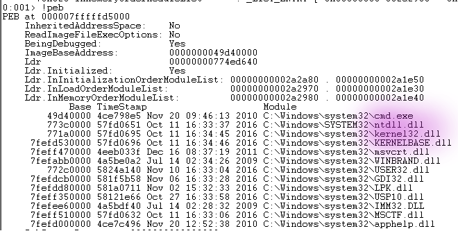
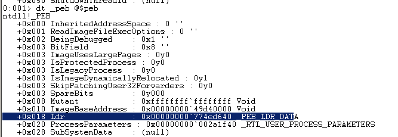

# Process Environment Block

A very brief look into the PEB in a process memory aiming to get a bit more comfortable with WinDBG and walking memory structures.

## Basics

First of, checking what members the `_PEB` structure actually entails:

```text
dt _peb
```

There are many fields in the structure among which there are ImageBaseAddresss and ProcessParameters which are interesting fields:


Getting the PEB address of the process:

```bash
0:001> r $peb
$peb=000007fffffd5000
```

The `_PEB` structure can now be overlaid on the memory pointed to by the `$peb` to see what values the structure members are holding/pointing to:

```bash
0:001> dt _peb @$peb
```

\_PEB structure is now populated with data:


Let's check what's in memory at address `0000000049d40000` - pointed by the ImageBaseAddress member of the \_peb structure:

```cpp
0:001> db 0000000049d40000 L100
```

Hey, this is the actual binary image of the running process:


Another way of finding the `ImageBaseAddress` is:

```csharp
0:001> dt _peb
ntdll!_PEB
//snip
      +0x010 ImageBaseAddress : Ptr64 Void
//snip

0:001> dd @$peb+0x010 L2
000007ff`fffd5010  49d40000 00000000

// 49d40000 00000000 is little-endian byte format - need to invert
0:001> db 0000000049d40000 L100
```

## Convenience

We can forget about all of the above and just use:

```text
!peb
```

This gets us a nicely formatted PEB information of some of the key members from the structure:


## Finding Commandline Arguments

Let's find the commandline the process was started with:

```cpp
dt _peb @$peb processp*
ntdll!_PEB
   +0x020 ProcessParameters : 0x00000000`002a1f40 _RTL_USER_PROCESS_PARAMETERS

dt _RTL_USER_PROCESS_PARAMETERS 0x00000000`002a1f40
```


We can be more direct and ask the same question like so:

```cpp
0:001> dt _UNICODE_STRING 0x00000000`002a1f40+70
ntdll!_UNICODE_STRING
 ""C:\Windows\system32\cmd.exe" "
   +0x000 Length           : 0x3c
   +0x002 MaximumLength    : 0x3e
   +0x008 Buffer           : 0x00000000`002a283c  ""C:\Windows\system32\cmd.exe" "
```

or even this:

```cpp
0:001> dd 0x00000000`002a1f40+70+8 L2
00000000`002a1fb8  002a283c 00000000
0:001> du 00000000002a283c
00000000`002a283c  ""C:\Windows\system32\cmd.exe" "
```


Since we now know where the commandline arguments are stored - can we modify them? Of course.

## Forging Commandline Arguments

```cpp
0:001> eu 00000000002a283c "cmdline-logging? Are You Sure?"
```


## \_PEB\_LDR\_DATA {#_peb_ldr_data-structure}

Getting a list of loaded modules by the process:

```cpp
// get the first _LIST_ENTRY structure address
0:001> dt _peb @$peb ldr->InMemoryOrderModuleList*
ntdll!_PEB
   +0x018 Ldr                          : 
      +0x020 InMemoryOrderModuleList      : _LIST_ENTRY [ 0x00000000`002a2980 - 0x00000000`002a1e40 ]


// walking the list manually and getting loaded module info

dt _LIST_ENTRY 0x00000000`002a2980
// cmd module
dt _LDR_DATA_TABLE_ENTRY 0x00000000`002a2980

dt _LIST_ENTRY 0x00000000`002a2980 
// ntdll module
dt _LDR_DATA_TABLE_ENTRY 0x00000000`002a2a70

dt _LIST_ENTRY 0x00000000`002a2a70
// kernel32 module
dt _LDR_DATA_TABLE_ENTRY 0x00000000`002a2df0

...loop...
```


If we check the loaded modules with `!peb`, it shows we were walking the list correctly:



Or another way to find the first `_LDR_DATA_TABLE_ENTRY`:

```cpp
dt _peb @$peb
dt _PEB_LDR_DATA 0x00000000`774ed640
dt _LDR_DATA_TABLE_ENTRY 0x00000000`002a2980
```




A nice way of getting a list of linked list structure addresses is by providing address of the first `list_entry` structure to the command `dl` and specifying how many list items it should print out:

```cpp
0:001> dl 0x00000000`002a2980 6
00000000`002a2980  00000000`002a2a70 00000000`774ed660
00000000`002a2990  00000000`00000000 00000000`00000000
00000000`002a2a70  00000000`002a2df0 00000000`002a2980
00000000`002a2a80  00000000`002a2f70 00000000`774ed670
00000000`002a2df0  00000000`002a2f60 00000000`002a2a70
00000000`002a2e00  00000000`002a3cb0 00000000`002a2f70
00000000`002a2f60  00000000`002a3ca0 00000000`002a2df0
00000000`002a2f70  00000000`002a2e00 00000000`002a2a80
00000000`002a3ca0  00000000`002a41f0 00000000`002a2f60
00000000`002a3cb0  00000000`002defc0 00000000`002a2e00
00000000`002a41f0  00000000`002a3ff0 00000000`002a3ca0
00000000`002a4200  00000000`002e1320 00000000`002a4000
```

Another way of achieving the same would be to use the !list command to list through the list items and dump the info:

```cpp
!list -x "dt _LDR_DATA_TABLE_ENTRY" 0x00000000`002a2980
```


Continuing further:


{% embed data="{\"url\":\"https://docs.microsoft.com/en-us/windows/desktop/api/winternl/ns-winternl-\_peb\_ldr\_data\",\"type\":\"link\",\"title\":\"\_PEB\_LDR\_DATA\",\"description\":\"Contains information about the loaded modules for the process.\",\"icon\":{\"type\":\"icon\",\"url\":\"https://docs.microsoft.com/favicon.ico\",\"aspectRatio\":0},\"thumbnail\":{\"type\":\"thumbnail\",\"url\":\"https://docs.microsoft.com/\_themes/docs.theme/master/en-us/\_themes/images/microsoft-header.png\",\"width\":128,\"height\":128,\"aspectRatio\":1}}" %}





{% embed data="{\"url\":\"https://docs.microsoft.com/en-us/windows-hardware/drivers/debugger/-list\",\"type\":\"link\",\"title\":\"list\",\"description\":\"The list extension executes the specified debugger commands repeatedly, once for every element in a linked list.\",\"icon\":{\"type\":\"icon\",\"url\":\"https://docs.microsoft.com/favicon.ico\",\"aspectRatio\":0},\"thumbnail\":{\"type\":\"thumbnail\",\"url\":\"https://docs.microsoft.com/\_themes/docs.theme/master/en-us/\_themes/images/microsoft-header.png\",\"width\":128,\"height\":128,\"aspectRatio\":1}}" %}

{% embed data="{\"url\":\"https://docs.microsoft.com/en-us/windows/desktop/api/winternl/ns-winternl-\_peb\_ldr\_data\",\"type\":\"link\",\"title\":\"\_PEB\_LDR\_DATA\",\"description\":\"Contains information about the loaded modules for the process.\",\"icon\":{\"type\":\"icon\",\"url\":\"https://docs.microsoft.com/favicon.ico\",\"aspectRatio\":0},\"thumbnail\":{\"type\":\"thumbnail\",\"url\":\"https://docs.microsoft.com/\_themes/docs.theme/master/en-us/\_themes/images/microsoft-header.png\",\"width\":128,\"height\":128,\"aspectRatio\":1}}" %}

