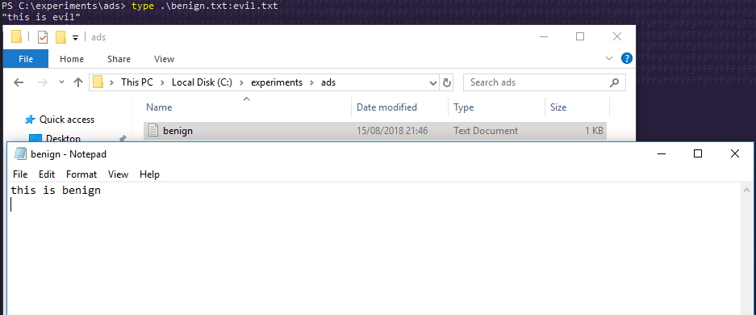

# T1096: Alternate Data Streams

## Execution

Creating a benign text file:



```csharp
echo "this is benign" > benign.txt
Get-ChildItem
```




Hiding an `evil.txt` file inside the `benign.txt`



```csharp
cmd '/c echo "this is evil" > benign.txt:evil.txt'
```




Note how the evil.txt file is not visible through the explorer - that is because it is in the alternate data stream now. Opening the benign.txt shows no signs of evil.txt. However, the data from evil.txt can still be accessed as shown below in the commandline - `type benign.txt:evil.txt`:



Additionally, we can view the data in the notepad as well by issuing:



```csharp
notepad .\benign.txt:evil.txt
```




## Observations


Note that powershell can also help finding alternate data streams:

```csharp
Get-Item c:\experiment\evil.txt -Stream *
Get-Content .\benign.txt -Stream evil.txt
```




{% embed data="{\"url\":\"https://docs.microsoft.com/en-us/powershell/module/microsoft.powershell.core/providers/filesystem-provider/get-item-for-filesystem?view=powershell-6\",\"type\":\"link\",\"title\":\"Get-Item for FileSystem\",\"icon\":{\"type\":\"icon\",\"url\":\"https://docs.microsoft.com/favicon.ico\",\"aspectRatio\":0},\"thumbnail\":{\"type\":\"thumbnail\",\"url\":\"https://docs.microsoft.com/\_themes/docs.theme/master/en-us/\_themes/images/microsoft-header.png\",\"width\":128,\"height\":128,\"aspectRatio\":1}}" %}

{% embed data="{\"url\":\"https://blog.malwarebytes.com/101/2015/07/introduction-to-alternate-data-streams/\",\"type\":\"link\",\"title\":\"Introduction to Alternate Data Streams - Malwarebytes Labs\",\"description\":\"What is an alternate data stream \(ADS\)? How it can be created and read, and how one can remove unwanted ADS?\",\"icon\":{\"type\":\"icon\",\"url\":\"https://www.malwarebytes.com/apple-touch-icon-152x152.png\",\"width\":152,\"height\":152,\"aspectRatio\":1},\"thumbnail\":{\"type\":\"thumbnail\",\"url\":\"https://blog.malwarebytes.com/wp-content/uploads/2015/07/header1.png\",\"width\":992,\"height\":355,\"aspectRatio\":0.35786290322580644}}" %}

