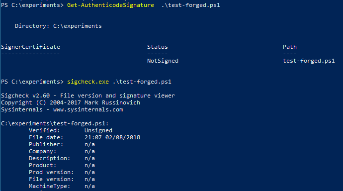
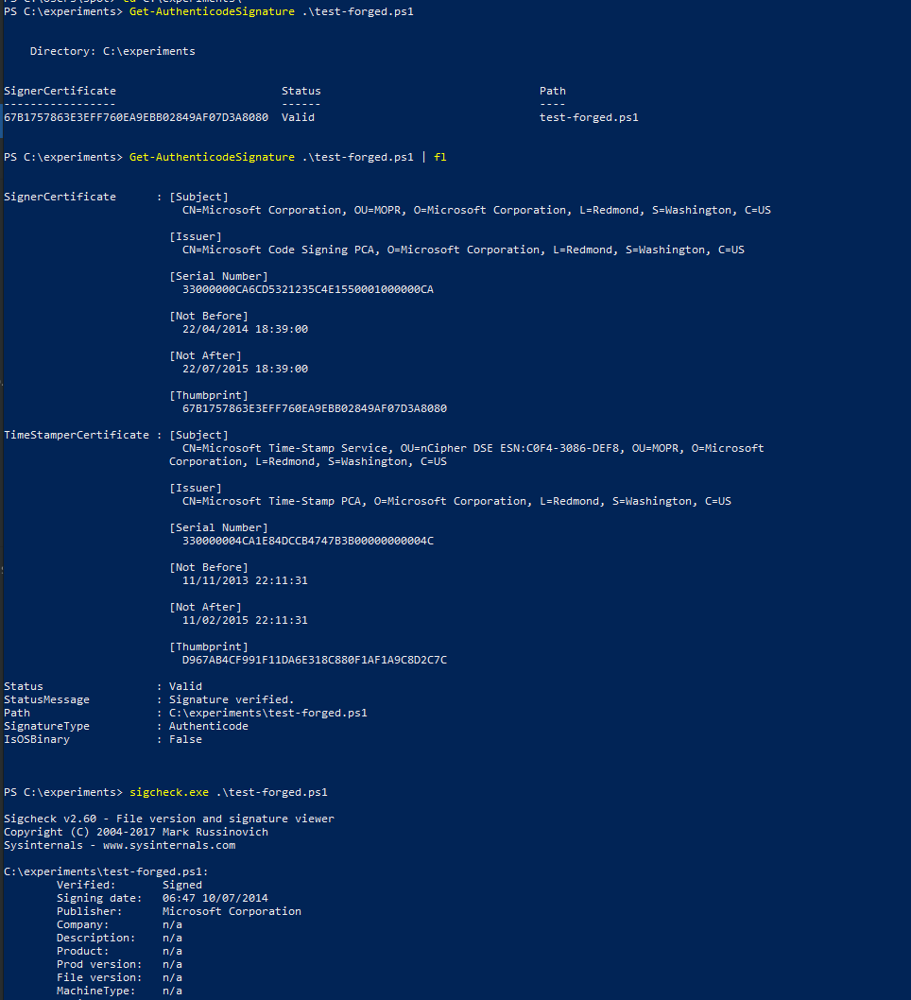

# T1198: SIP & Trust Provider Hijacking

## Execution

I will try to sign a simple "rogue" powershell script `test-forged.ps1` that only has one line of code with a **Microsoft's** certificate to appear like a legitimate script and also bypass any whitelisting protections/policies the script may be subject to if not signed:


Just before I start, let's make sure that the script is not signed by using a `Get-AuthenticodeSignature` cmdlet and `sigcheck` by SysInternals:



In order to sign the script with Microsoft's certificate, we need to first find a native Microsoft Signed PowerShell script. I used powershell for this:

```bash
Get-ChildItem -Path C:\*.ps* -Recurse -ErrorAction SilentlyContinue | Select-String -Pattern "# SIG # Begin signature block"
```


I chose one script at random and simply checked if it was signed by just printing it out:

```bash
type C:\Windows\WinSxS\x86_microsoft-windows-m..ell-cmdlets-modules_31bf3856ad364e35_10.0.16299.15_none_c7c20f51cd336675\Wdac.psd1
```


Copied the Microsoft's signature block to my script:


Modified registry at:

`HKLM\SOFTWARE\Microsoft\Cryptography\OID\EncodingType 0\CryptSIPDllVerifyIndirectData\{603BCC1F-4B59-4E08-B724-D2C6297EF351}`

From:


To:



```text
C:\Windows\System32\ntdll.dll
```





```text
DbgUIContinue
```




Now, let's launch a new powershell instance \(for the registry changes to take effect\) and check the signature of the forged file now - note how the file is now signed with a Microsoft's certificate, and the signature is verified and valid:



## Observations

Monitoring the following registry keys/values helps discover suspicious activity:


For all the registry keys/values that should be used as a baseline, please refer to the original research whitepaper by Matt Graeber:   
[SpecterOps Subverting Trust inWindows](https://specterops.io/assets/resources/SpecterOps_Subverting_Trust_in_Windows.pdf)



{% embed data="{\"url\":\"https://www.youtube.com/watch?v=wxmxxgL6Nz8\",\"type\":\"video\",\"title\":\"K00 Subverting Trust in Windows A Case Study of the How and Why of Engaging in Security Research Mat\",\"description\":\"These are the videos from Derbycon 7 \(2017\):\\nhttp://www.irongeek.com/i.php?page=videos/derbycon6/mainlist\",\"icon\":{\"type\":\"icon\",\"url\":\"https://www.youtube.com/yts/img/favicon\_144-vfliLAfaB.png\",\"width\":144,\"height\":144,\"aspectRatio\":1},\"thumbnail\":{\"type\":\"thumbnail\",\"url\":\"https://i.ytimg.com/vi/wxmxxgL6Nz8/maxresdefault.jpg\",\"width\":1280,\"height\":720,\"aspectRatio\":0.5625},\"embed\":{\"type\":\"player\",\"url\":\"https://www.youtube.com/embed/wxmxxgL6Nz8?rel=0&showinfo=0\",\"html\":\"<div style=\\\"left: 0; width: 100%; height: 0; position: relative; padding-bottom: 56.2493%;\\\"><iframe src=\\\"https://www.youtube.com/embed/wxmxxgL6Nz8?rel=0&amp;showinfo=0\\\" style=\\\"border: 0; top: 0; left: 0; width: 100%; height: 100%; position: absolute;\\\" allowfullscreen scrolling=\\\"no\\\"></iframe></div>\",\"aspectRatio\":1.7778}}" %}

{% embed data="{\"url\":\"https://pentestlab.blog/2017/11/06/hijacking-digital-signatures/\",\"type\":\"link\",\"title\":\"Hijacking Digital Signatures\",\"description\":\"Developers are usually signing their code in order to provide assurance to users that their software is trusted and it has not been modified in a malicious way. This is done with the use of digital…\",\"icon\":{\"type\":\"icon\",\"url\":\"https://s1.wp.com/i/favicon.ico\",\"aspectRatio\":0},\"thumbnail\":{\"type\":\"thumbnail\",\"url\":\"https://pentestlab.files.wordpress.com/2017/10/powershell-script-digital-microsoft-signature.png\",\"width\":1226,\"height\":200,\"aspectRatio\":0.1631321370309951}}" %}



{% embed data="{\"url\":\"https://blogs.msdn.microsoft.com/sqlforum/2011/01/02/walkthrough-request-a-digital-certificate-from-certificate-server-or-create-a-testing-digital-certificate-to-sign-a-package/\",\"type\":\"link\",\"title\":\"Walkthrough: Request a Digital Certificate from Certificate Server or create a testing Digital Certificate to sign a Package\",\"description\":\"This topic describes how to request a digital certificate from a certificiate server\(CA\), or create a testing only digital certificate, and then use the digital certificate to sign an Integration Services package. Request a Code Signing certificate using the Active Directory Certificate Services web interface. 1. Open the Internet Explorer\(IE\) 2. Type the URL for...\",\"icon\":{\"type\":\"icon\",\"url\":\"https://blogs.msdn.microsoft.com/sqlforum/wp-content/themes/microsoft-msdn/images/favicon-msdn.png\",\"aspectRatio\":0}}" %}

{% embed data="{\"url\":\"https://www.youtube.com/watch?v=WrHTJQovDoY\",\"type\":\"video\",\"title\":\"Installing Enterprise Root Certificate Authority in Windows Server 2012 R2\",\"description\":\"In this video we will look at how to install a Root Certificate Authority on Windows Server 2012 R2. The root CA forms the top of the certificate hierarchy. \\nBy MSFTWebCast\",\"icon\":{\"type\":\"icon\",\"url\":\"https://www.youtube.com/yts/img/favicon\_144-vfliLAfaB.png\",\"width\":144,\"height\":144,\"aspectRatio\":1},\"thumbnail\":{\"type\":\"thumbnail\",\"url\":\"https://i.ytimg.com/vi/WrHTJQovDoY/maxresdefault.jpg\",\"width\":1280,\"height\":720,\"aspectRatio\":0.5625},\"embed\":{\"type\":\"player\",\"url\":\"https://www.youtube.com/embed/WrHTJQovDoY?rel=0&showinfo=0\",\"html\":\"<div style=\\\"left: 0; width: 100%; height: 0; position: relative; padding-bottom: 56.2493%;\\\"><iframe src=\\\"https://www.youtube.com/embed/WrHTJQovDoY?rel=0&amp;showinfo=0\\\" style=\\\"border: 0; top: 0; left: 0; width: 100%; height: 100%; position: absolute;\\\" allowfullscreen scrolling=\\\"no\\\"></iframe></div>\",\"aspectRatio\":1.7778}}" %}

{% embed data="{\"url\":\"https://www.hanselman.com/blog/SigningPowerShellScripts.aspx\",\"type\":\"link\",\"title\":\"Signing PowerShell Scripts\",\"description\":\"Geoff Bard at Corillian \(we work together\) wrote up a good tutorial on working/playing with Signed PowerShell scripts. ...\",\"icon\":{\"type\":\"icon\",\"url\":\"https://www.hanselman.com/images/apple-touch-icon-114x114.png\",\"width\":114,\"height\":114,\"aspectRatio\":1},\"thumbnail\":{\"type\":\"thumbnail\",\"url\":\"http://www.hanselman.com/blog/content/binary/image001.gif\",\"width\":385,\"height\":431,\"aspectRatio\":1.1194805194805195}}" %}

